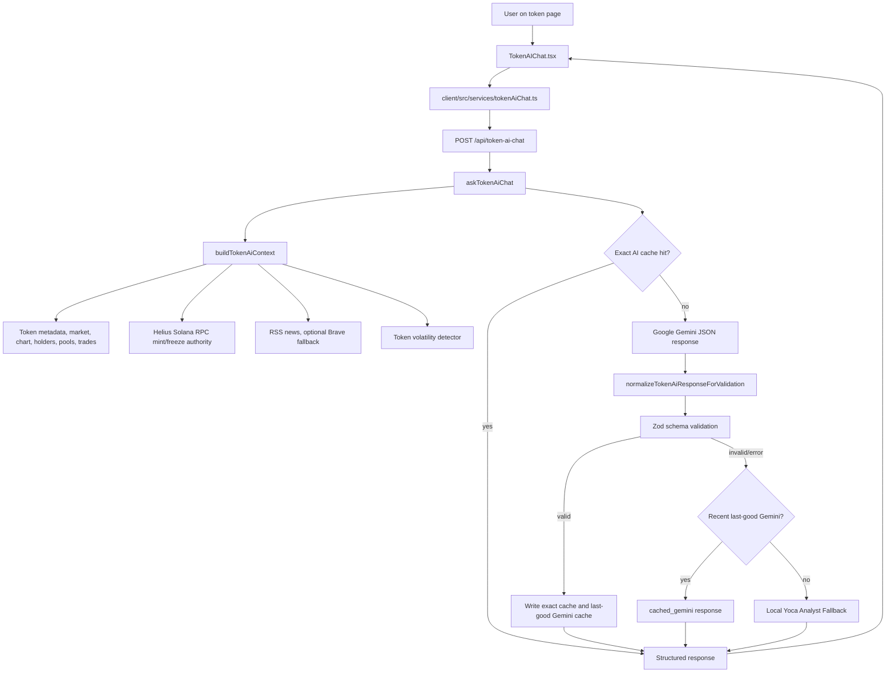
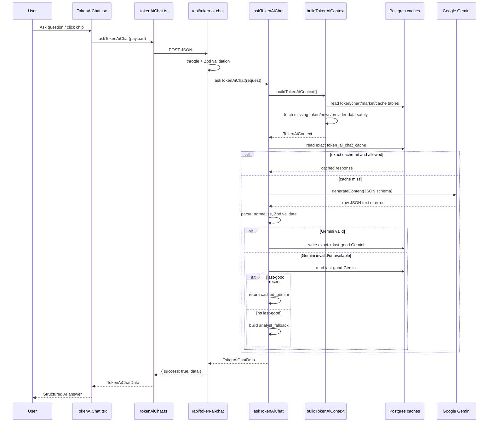

# AI_token

## Overview

The "Ask Yoca AI" token feature lets a user ask natural-language questions about a specific token and receive a structured answer grounded in Yoca's token evidence. It is intended to answer questions such as price movement, latest news, risk, bullish/bearish signals, simple explanations, and "what should I watch next" without forcing the user to manually combine chart, market, holder, pool, news, volatility, and available on-chain context.

The feature appears on:

- `client/src/pages/token/index.tsx`, in the right column below `VolatilitySignals`.
- `client/src/pages/token-overview/index.tsx`, below `TokenInsightTabs`.

High-level architecture:

- Frontend renders `TokenAIChat`, suggested question chips, a question text area, loading/error states, and structured answer cards.
- Frontend calls `POST /api/token-ai-chat` through the Hono client wrapper in `client/src/services/tokenAiChat.ts`.
- Backend route validates and rate-limits the request, infers language, and calls `askTokenAiChat`.
- `askTokenAiChat` builds a token evidence context from internal token services and RSS/Brave news, checks cache, calls Gemini when configured, normalizes and validates Gemini JSON, and falls back when needed.
- Responses include structured sections, TLDR bullets, evidence, sources, warnings, confidence, provider/cache metadata, and a disclaimer.



## Current Architecture

Frontend:

- `client/src/components/token/TokenAIChat.tsx` is the main component.
- `client/src/components/token/TokenAIChat.module.scss` contains all feature-specific styles.
- `client/src/services/tokenAiChat.ts` defines frontend request/response types and calls the backend.
- `client/src/api/main.ts` registers the typed Hono client for `/api/token-ai-chat`.
- `client/src/components/token/index.ts` exports `TokenAIChat`.

Backend route/controller:

- `server/src/routes/token-ai-chat.ts` defines `POST /api/token-ai-chat`.
- `server/src/main.ts` mounts it at `/api/token-ai-chat`.

Backend services:

- `server/src/services/tokens/token-ai-chat.service.ts` owns intent classification, response schema, Gemini integration, normalization, fallback answer generation, cache orchestration, and final response assembly.
- `server/src/services/tokens/token-ai-context.ts` builds the evidence bundle used by Gemini and fallback answers.
- `server/src/services/tokens/token-ai-chat-cache.ts` reads/writes exact AI responses and last-successful Gemini responses in Postgres.
- `server/src/services/tokens/token-security-context.ts` fetches parsed Solana mint authority and freeze authority context through Helius RPC.

LLM provider:

- Current token AI chat provider is Google Gemini through `@google/genai`.
- The service reads the API key from `env.GOOGLE_AI_KEY`.
- `GEMINI_API_KEY` is logged as a diagnostic boolean but is not used by `getGeminiApiKey()` for this feature.

Token data sources:

- CoinGecko token details, market data, chart data, holder stats, top pools, and pool trades through the existing token services.
- Moralis top-holder API through `getTopTokenHolders`.
- Helius Solana RPC for parsed mint/freeze authority evidence.
- Existing Postgres tables cache token metadata, market, chart, holders, pools, and trades.

News/data dependencies:

- `getRssTokenNews()` from `server/src/services/rss-news.service.ts`.
- RSS is attempted first.
- Brave News and Brave Web are bounded fallbacks when RSS coverage is too thin and Brave is enabled.
- This flow is related to `docs/news/RSS_BRAVE_NEWS.md`; that document describes the broader token news subsystem. Token AI chat consumes the same `getRssTokenNews()` service.

Cache layers:

- `token_ai_chat_cache` table for exact AI chat responses.
- Reserved rows in the same table for last-successful Gemini responses.
- Separate token data caches in the token service tables.
- RSS/Brave token news has in-memory image cache and bounded Brave usage counters but no persistent direct token-news response cache in the files inspected.

Validation:

- Backend request validation uses Zod in `server/src/routes/token-ai-chat.ts`.
- Gemini output validation uses Zod in `token-ai-chat.service.ts`.
- Environment validation uses `envSchema` in `server/src/middlewares/validation.ts`, loaded by `server/src/util/load-env.ts`.

## Component Inventory

### File: `client/src/components/token/TokenAIChat.tsx`

- Purpose: Main Ask Yoca AI UI.
- Responsibilities: Suggested question chips, text input, validation, submit behavior, loading/error display, structured answer rendering, rich text rendering, evidence/source expansion, confidence/provider/cache metadata, disclaimer display.
- Dependencies: Carbon `Button`, `TextArea`, Carbon icons, `classnames`, React state/hooks, React Router `Link`, `askTokenAiChat`, CSS module.
- Key functions/classes: `TokenAIChat`, `TokenAiRichText`, `AnswerSection`, `SectionTable`, `getProviderLabel`, `normalizeVisibleWarnings`, `renderInlineRichText`, `renderMetricTokens`.
- Notes: No `dangerouslySetInnerHTML` is used. Rich rendering is tokenized into React nodes.

### File: `client/src/components/token/TokenAIChat.module.scss`

- Purpose: CSS module for the Ask Yoca AI panel.
- Responsibilities: Panel layout, chips, input row, answer cards, confidence badges, rich text, evidence/source cards, responsive layout.
- Dependencies: Carbon theme tokens through `@carbon/react/scss/theme`.
- Key classes: `panel`, `chips`, `chip`, `inputRow`, `loading`, `error`, `answer`, `answerMode`, `confidenceBadge`, `tldr`, `answerSection`, `evidenceGrid`, `sourcesList`, `footerMeta`.
- Notes: Model/provider chips wrap long model names via `overflow-wrap: anywhere`.

### File: `client/src/services/tokenAiChat.ts`

- Purpose: Frontend API service and type definitions.
- Responsibilities: Defines `TokenAiChatPayload`, `TokenAiChatData`, section/evidence/source types, provider union, and the `askTokenAiChat()` API call.
- Dependencies: `client/src/api/main.ts`.
- Key functions/classes: `askTokenAiChat`.
- Notes: Uses `(client.api.tokenAiChat.index as any).$post({ json: payload })`; on non-OK response it extracts `message` or `error` from JSON and throws.

### File: `client/src/api/main.ts`

- Purpose: Central typed Hono client setup.
- Responsibilities: Adds `/api/token-ai-chat` client and uses `VITE_CLIENT_API_DOMAIN` as optional API domain.
- Dependencies: `hono/client`, `@sv/main.js` route types.
- Key functions/classes: `hcc`, `ApiClient`.
- Notes: Requests include `credentials: "include"`.

### File: `client/src/pages/token/index.tsx`

- Purpose: Token detail page with pool-specific layout.
- Responsibilities: Mounts `TokenAIChat` with `address`, `meta.symbol`, `meta.name`, and `timeframe="24h"`.
- Dependencies: Token page data and token components.
- Key functions/classes: page component.
- Notes: Feature appears in the right column under `VolatilitySignals`.

### File: `client/src/pages/token-overview/index.tsx`

- Purpose: Token overview page.
- Responsibilities: Mounts `TokenAIChat` with token address/details and `timeframe="24h"`.
- Dependencies: Token overview data and token components.
- Notes: Feature appears below `TokenInsightTabs`.

### File: `client/src/components/token/index.ts`

- Purpose: Barrel export for token components.
- Responsibilities: Exports `TokenAIChat`.
- Dependencies: Token component files.

### File: `server/src/routes/token-ai-chat.ts`

- Purpose: Backend Hono route for token AI chat.
- Responsibilities: In-memory IP throttle, JSON body parsing, Zod request validation, language inference, service call, safe error responses.
- Dependencies: `askTokenAiChat`, `inferTokenAiLanguage`, `setErr`, `statusCode`, Hono, Zod.
- Key functions/classes: `tokenAiChatRequestSchema`, `getIp`, `isAllowed`, route `post("/")`.
- Notes: Rate limit is 8 requests per 60 seconds per `x-forwarded-for`, `x-real-ip`, or `"global"`.

### File: `server/src/main.ts`

- Purpose: Server route mounting.
- Responsibilities: Imports and mounts `/api/token-ai-chat`; exposes route type in `AppRoutes`; applies logger, request context, CORS, and dev CSRF.
- Dependencies: Hono, `@hono/node-server`, middleware, route modules.

### File: `server/src/services/tokens/token-ai-chat.service.ts`

- Purpose: Core AI token chat orchestration.
- Responsibilities: Intent classification, language inference, prompt construction, Gemini request, Gemini JSON parsing, normalization, Zod validation, response shaping, exact cache handling, last-good Gemini fallback, local analyst fallback, response limits.
- Dependencies: `@google/genai`, Zod, `buildTokenAiContext`, `hashTokenAiContext`, token AI cache helpers, `env.GOOGLE_AI_KEY`, `WALLET_AUDIT_MODEL`.
- Key functions/classes: `askTokenAiChat`, `generateGeminiAnswer`, `generateGeminiAnswerForModel`, `normalizeTokenAiResponseForValidation`, `buildPrompt`, `buildDeterministicAnswer`, `classifyTokenAiIntent`, `inferTokenAiLanguage`.
- Notes: Provider values include `gemini`, `gemini_model_fallback`, `cached_gemini`, `analyst_fallback`, and legacy-compatible `deterministic`.

### File: `server/src/services/tokens/token-ai-context.ts`

- Purpose: Builds the evidence context for Gemini and fallback answers.
- Responsibilities: Fetch token details/meta, market data, chart summary, holders, holder stats, security context, news, volatility events, pools, recent trades, evidence, sources, and missing sections.
- Dependencies: Token service barrel, `getRssTokenNews`, `getTokenPriceVolatilityEvents`, `getTokenSecurityContext`.
- Key functions/classes: `buildTokenAiContext`, `hashTokenAiContext`, `readChartSummary`, `safe`, `dedupeArticles`, `groupArticlesByDate`.
- Notes: Uses `safe()` wrappers so individual data source failures become `missingSections` instead of failing the entire context build.

### File: `server/src/services/tokens/token-ai-chat-cache.ts`

- Purpose: Token AI response cache helpers.
- Responsibilities: Compute TTL expiry, read/write exact cache entries, read/write last-successful Gemini entries, handle missing table gracefully.
- Dependencies: Drizzle `db`, `tokenAiChatCache` schema.
- Key functions/classes: `getTokenAiChatCacheExpiresAt`, `readTokenAiChatCache`, `writeTokenAiChatCache`, `readLastSuccessfulGeminiCache`, `writeLastSuccessfulGeminiCache`.
- Notes: Missing table error logs once per read path and returns `null` rather than failing the chat.

### File: `server/src/services/tokens/token-security-context.ts`

- Purpose: On-chain mint/freeze authority evidence.
- Responsibilities: Uses Helius RPC to fetch parsed SPL mint account data, returns authority status, supply, decimals, initialization, Wrapped SOL interpretation, or unavailable warnings.
- Dependencies: `@solana/web3.js`, `getNextkey` from Helius utility.
- Key functions/classes: `getTokenSecurityContext`.
- Notes: Invalid or non-mint addresses are returned as unavailable security context, not route validation errors.

### File: `server/src/services/rss-news.service.ts`

- Purpose: RSS-first token news aggregation used by token AI context.
- Responsibilities: Build token identity, select feeds, fetch RSS, score and filter token relevance, dedupe, optionally use Brave News and Brave Web fallback, enrich images, return provider metadata.
- Dependencies: `rss-parser`, `brave-news.service.ts`.
- Key functions/classes: `getRssTokenNews`, `TokenNewsArticle`, `TokenNewsRequest`, `TokenNewsOptions`.
- Notes: Token AI context calls it with `{ maxArticles: 20 }` and then uses up to 5 deduped articles in prompt context.

### File: `server/src/services/brave-news.service.ts`

- Purpose: Brave Search fallback for token news.
- Responsibilities: Brave availability guard, usage counter, query construction, endpoint calls, result normalization/deduplication.
- Dependencies: direct `fetch`, `BRAVE_SEARCH_API_KEY`, `BRAVE_SEARCH_ENABLED`.
- Key functions/classes: `fetchBraveTokenNews`, `fetchBraveTokenWebMentions`, `getBraveSearchUnavailableReason`, `buildBraveNewsQueries`, `buildBraveWebMentionQueries`.
- Notes: Brave News timeout is 10 seconds. Brave is disabled unless `BRAVE_SEARCH_ENABLED=true`.

### File: `server/src/services/tokens/index.ts`

- Purpose: Token service barrel used by `token-ai-context.ts`.
- Responsibilities: Re-exports chart, holder, token info, market data, pools, trades, trending, and historical services.
- Dependencies: Token service modules.

### File: `server/src/services/tokens/token-info.ts`

- Purpose: Token metadata, detailed info, and holder stats.
- Responsibilities: Fetches and caches CoinGecko token metadata/details/market data and holder stats.
- Dependencies: CoinGecko client, Drizzle tables.
- Key functions/classes: `getTokenDetails`, `getTokenMeta`, `getTokenHolderStats`.

### File: `server/src/services/tokens/token-market-data.ts`

- Purpose: Token market price/volume data.
- Responsibilities: Reads cached market data, fetches stale data from CoinGecko, handles CoinGecko 429 by returning stale DB rows.
- Dependencies: CoinGecko, token list, Drizzle.
- Key functions/classes: `getTokenMarketData`, `fetchCgMarketDataBatched`.

### File: `server/src/services/tokens/token-chart.ts`

- Purpose: Token chart price series.
- Responsibilities: Reads/fetches 24h, hourly, and daily CoinGecko chart data; caches chart rows.
- Dependencies: CoinGecko, Birdeye for some history code paths, Drizzle, API tracker.
- Key functions/classes: `get24hTokenMarketChart`, `getHourlyTokenMarketChart`, `getDailyTokenMarketChart`.

### File: `server/src/services/tokens/token-holders.ts`

- Purpose: Top token holder data.
- Responsibilities: Reads cached top holders; fetches stale/missing data from Moralis Solana gateway.
- Dependencies: Moralis utility, Drizzle.
- Key functions/classes: `getTopTokenHolders`.

### File: `server/src/services/tokens/token-pools.ts`

- Purpose: Top liquidity pool data.
- Responsibilities: Fetches/caches CoinGecko on-chain pool data, pool liquidity, price changes, buy/sell counts, volume, DEX logo metadata.
- Dependencies: CoinGecko, Drizzle, API tracker.
- Key functions/classes: `getTokenTopPools`, `getTokenPoolData`, `getTokenPoolDataList`.

### File: `server/src/services/tokens/token-trades.ts`

- Purpose: Recent top-pool trades.
- Responsibilities: Reads cached pool trades; fetches stale/missing trades from CoinGecko on-chain pool trades endpoint.
- Dependencies: CoinGecko, Drizzle, API tracker.
- Key functions/classes: `getPoolTrades24h`.

### File: `server/src/services/tokens/token-volatility.ts`

- Purpose: Price volatility event detection.
- Responsibilities: Builds price point series from chart data and detects price spikes/drops above threshold.
- Dependencies: Token chart services.
- Key functions/classes: `getTokenPriceVolatilityEvents`, `TokenPriceVolatilityEvent`.

### File: `server/src/db/schema.ts`

- Purpose: Database schema.
- Responsibilities: Defines `token_ai_chat_cache` and token data cache tables used by the feature.
- Dependencies: Drizzle schema declarations.
- Key model: `tokenAiChatCache`.
- Notes: Unique index covers token address, question hash, timeframe, language, prompt version, model, and evidence hash.

### File: `server/src/middlewares/validation.ts`

- Purpose: Environment schema and utility validation helpers.
- Responsibilities: Validates required server env on boot; defines provider key/base URL defaults.
- Dependencies: Zod.
- Key functions/classes: `envSchema`, `validateResponseDataSchema`.

### File: `server/src/util/load-env.ts`

- Purpose: Loads `.env` and validates it.
- Responsibilities: Searches `server/.env`, workspace `.env`, then process `.env`; validates with `envSchema`; exits process on invalid env.
- Dependencies: `dotenv`, Zod, `envSchema`.

### File: `server/src/config/constants.ts`

- Purpose: Shared constants.
- Responsibilities: Defines token cache TTLs, chart update thresholds, `WALLET_AUDIT_MODEL`, `GOOGLE_AI_KEY`, outbound fetch timeout, API call tracker config.
- Dependencies: `env`.

### File: `server/src/util/util-coingecko.ts`

- Purpose: CoinGecko endpoint/client utility.
- Responsibilities: Builds URLs, required headers, Coingecko client, safe schema validation.
- Dependencies: `COINGECKO_API_BASE_URL`, `COINGECKO_API_KEY`.

### File: `server/src/util/util-moralis.ts`

- Purpose: Moralis Solana gateway utility.
- Responsibilities: Builds base URL, rotates API keys through `apiKeyManager`, retries 429 responses up to 2 times with wait.
- Dependencies: `MORALIS_API_KEY`, optional `MORALIS_SOLANA_GATEWAY_BASE_URL`.

### File: `server/src/util/util-helius.ts`

- Purpose: Helius API/RPC utility.
- Responsibilities: Builds API URLs, rotates API keys, retries 429 responses up to 2 times, exposes `getNextkey()` for RPC URL construction.
- Dependencies: `HELIUS_API_KEY`, optional `HELIUS_API_BASE_URL`.

### File: `server/src/util/outbound-fetch.ts`

- Purpose: Shared outbound fetch timeout helper.
- Responsibilities: Adds `AbortSignal.timeout(OUTBOUND_FETCH_TIMEOUT_MS)` to fetch requests.
- Dependencies: `OUTBOUND_FETCH_TIMEOUT_MS`.

### File: `server/src/services/tracking/apiCallTracker.service.ts`

- Purpose: Optional API call tracking.
- Responsibilities: Wraps outbound fetches, records request/response metadata when enabled, redacts headers/body via tracker utilities.
- Dependencies: `API_CALL_TRACKER_*` constants, request context middleware.

### File: `docs/news/RSS_BRAVE_NEWS.md`

- Purpose: Existing documentation for RSS/Brave token news.
- Responsibilities: Explains the broader token news pipeline consumed by token AI chat.
- Notes: This AI token document references it for news subsystem details but documents only the behavior used by Ask Yoca AI.

## End-to-End Data Flow

1. User opens `/tokens/:address` or `/tokens/:address/:poolAddress`.
2. The token page mounts `TokenAIChat` with `address`, optional `symbol`, optional `name`, and `timeframe="24h"`.
3. The user either clicks a suggested question chip or enters a custom question and presses Send or Enter without Shift.
4. `TokenAIChat.submitQuestion()` validates non-empty input and length <= 500, sets loading, and calls `askTokenAiChat()`.
5. `client/src/services/tokenAiChat.ts` sends `POST /api/token-ai-chat` through the Hono client.
6. `server/src/routes/token-ai-chat.ts` applies in-memory throttle, parses JSON, validates body with Zod, infers language, and calls `askTokenAiChat`.
7. `askTokenAiChat` classifies intent from the question.
8. `buildTokenAiContext` trims the address and fetches:
   - token details and fallback metadata,
   - market data,
   - chart summary,
   - top holders and holder stats,
   - Solana mint/freeze authority security context,
   - token news when enabled and symbol/name exist,
   - volatility events when enabled and symbol/name exist,
   - top pools and recent top-pool trades.
9. Context builder creates evidence entries, source entries, and missing section records.
10. `askTokenAiChat` hashes `compactContextForPrompt(context)` to form `evidenceHash`, then checks exact DB cache.
11. If exact cache is usable, backend returns it with `cache.hit=true`.
12. If no usable exact cache exists, backend calls Gemini using the requested model mode, defaulting to deep.
13. Gemini output is parsed as JSON, normalized by `normalizeTokenAiResponseForValidation`, then validated by `geminiResponseSchema`.
14. If Gemini succeeds, the response provider is `gemini` or `gemini_model_fallback`.
15. If Gemini fails, backend tries a recent last-successful Gemini answer for the same token/intent/timeframe/language/prompt version.
16. If last-good is available and recent enough, backend returns `cached_gemini` with `stale=true`.
17. If not, backend returns a local `analyst_fallback` response built from current evidence.
18. Backend writes exact cache. Successful Gemini responses are also written to last-good Gemini cache.
19. Frontend receives the structured response, clears loading, resets evidence/source expansion, and renders TLDR, sections, warnings, evidence, sources, footer metadata, and disclaimer.



## Frontend Implementation

Main component paths:

- `client/src/components/token/TokenAIChat.tsx`
- `client/src/components/token/TokenAIChat.module.scss`
- `client/src/services/tokenAiChat.ts`

UI behavior:

- Header: "Ask Yoca AI" plus a short explanation.
- Suggested chips:
  - "Why is this token moving?"
  - "What is the latest news?"
  - "What are the bullish and bearish signals?"
  - "Is this token risky?"
  - "Should I buy this token now?"
  - "What should I watch next?"
  - "Explain this token simply."
- Input: Carbon `TextArea`, max length 500, placeholder for price/news/risk/signal questions.
- Submit: Carbon `Button` with `Send` icon.
- Keyboard: Enter submits; Shift+Enter creates a newline.

State management:

- `question`: current text area value.
- `answer`: latest `TokenAiChatData` or `null`.
- `isLoading`: disables chips/input/send and shows loading.
- `error`: backend or network error message.
- `showAllEvidence`: toggles evidence from first 6 to all.
- `showAllSources`: toggles sources from first 5 to all.

Loading state:

- Shows `Analyzing token evidence...` in a styled loading box.

Error state:

- Shows thrown message from `askTokenAiChat()`.
- Backend non-OK responses are converted to a message in `client/src/services/tokenAiChat.ts`.

Empty state:

- With no answer and no error, only header, chips, input, and character count are shown.

Retry behavior:

- There is no automatic frontend retry.
- User can submit again manually.

Rich text rendering:

- `TokenAiRichText` trims text and returns `null` for empty values.
- Supports inline rendering and block rendering.
- Block rendering splits paragraphs by blank lines and detects bullet-like lines.
- Markdown support is limited to bold segments written as `**text**`.
- Markdown artifacts `**` are stripped outside bold handling.
- No HTML is rendered and no `dangerouslySetInnerHTML` is used.

Highlighting:

- `METRIC_OR_SIGNAL_PATTERN` matches percentages, dollar values, counts, volume/market cap phrases, bearish/risk words, bullish/support words, and warning/unavailable words.
- `getMetricClass()` maps matches to CSS classes:
  - positive percentages: `metricPositive`
  - negative percentages: `metricNegative`
  - dollar values: `metricMoney`
  - warning/unavailable phrases: `warningText`
  - bearish/risk phrases: `riskText`
  - bullish/support/liquidity phrases: `bullishText`
  - default: `metricNeutral`

Section/card rendering:

- `AnswerSection` renders section icon, title, kind label, optional content, optional bullets, and optional table.
- Section kinds map to labels and style classes in `SECTION_KIND_META`.
- `SectionTable` derives up to 6 columns from row keys and renders cells with `TokenAiRichText`.

Evidence/source rendering:

- Evidence is sorted by priority: market, chart, volatility, holders, security, pool, news, then other.
- First 6 evidence cards are shown by default.
- Evidence cards show type badge, optional timestamp, label as link if URL exists, value, detail, and source.
- Sources show first 5 by default and include title, snippet, publisher/domain, published time, and an `Open` cue.

Warnings:

- Frontend filters weak unavailable warnings and dedupes warning text.
- Displays up to 3 visible warnings.
- Header changes to `Data Limitations` when a security limitation is detected.

Confidence/provider/cache display:

- Header shows confidence badge with class based on `High`, `Medium`, or `Low`.
- Mode row shows model mode, provider label, model used when present, stale marker when present, and cache hit/miss.
- Footer shows provider label, cache hit/miss, and fallback reason with underscores replaced by spaces.

Disclaimer:

- Footer always renders `answer.disclaimer` through `TokenAiRichText`.

## Backend API Reference

### Endpoint

- Method: `POST`
- Route: `/api/token-ai-chat`
- Purpose: Answer a user question about a specific token using Yoca evidence and Gemini/fallback logic.

Request body:

```ts
{
  address: string;              // required, trimmed, min 1
  symbol?: string;              // optional, trimmed, min 1, max 32
  name?: string;                // optional, trimmed, min 1, max 128
  question: string;             // required, trimmed, min 1, max 500
  timeframe?: "24h" | "7d" | "1m" | "3m" | "1y"; // default "24h"
  language?: "en" | "vi";       // optional; inferred when omitted
  includeNews?: boolean;        // default true
  includeVolatility?: boolean;  // default true
  modelMode?: "fast" | "balanced" | "deep"; // optional
}
```

Query parameters:

- None.

Headers:

- `Content-Type: application/json`.
- Client uses `credentials: "include"`.
- Rate limit identity reads `x-forwarded-for`, then `x-real-ip`, then `"global"`.

Success response:

```ts
{
  success: true;
  data: TokenAiChatData;
}
```

Example response shape:

```json
{
  "success": true,
  "data": {
    "token": {
      "address": "So11111111111111111111111111111111111111112",
      "symbol": "SOL",
      "name": "Wrapped SOL",
      "yocaUrl": "/tokens/So11111111111111111111111111111111111111112"
    },
    "question": "Why is this token moving?",
    "intent": "price_move_explanation",
    "tldr": ["..."],
    "sections": [
      {
        "title": "What The Move Implies",
        "kind": "key_drivers",
        "bullets": ["..."]
      }
    ],
    "evidence": [],
    "sources": [],
    "warnings": [],
    "confidence": "Medium",
    "asOf": "2026-06-19T00:00:00.000Z",
    "disclaimer": "For information only, not financial advice. Verify the data and consider your own risk before making decisions.",
    "generatedAt": "2026-06-19T00:00:00.000Z",
    "provider": "gemini",
    "modelModeRequested": "deep",
    "modelModeUsed": "deep",
    "modelRequested": "gemini-2.5-flash",
    "modelUsed": "gemini-2.5-flash",
    "cache": {
      "hit": false,
      "expiresAt": "2026-06-19T00:10:00.000Z"
    }
  }
}
```

Error cases:

- Too many requests: `429`, `success:false`, message `Too many token AI chat requests. Please wait and try again.`
- Invalid JSON body: `400`, message `Invalid JSON body`.
- Invalid request body: `400`, message `Invalid request body`, includes Zod `details`.
- Unhandled service error: `500`, message `Token AI chat failed.`

Validation behavior:

- Route validates only syntax and length/enum constraints.
- It does not validate that `address` is a valid Solana public key at the route layer.
- Invalid token/provider data is handled downstream as missing sections or, if unhandled, a 500.

## Request and Response Schemas

Frontend request shape is `TokenAiChatPayload` in `client/src/services/tokenAiChat.ts`.

Backend request DTO is `TokenAiChatRequest` in `token-ai-chat.service.ts`:

```ts
export interface TokenAiChatRequest {
  address: string;
  symbol?: string;
  name?: string;
  question: string;
  timeframe: TokenAiTimeframe;
  language: TokenAiLanguage;
  includeNews: boolean;
  includeVolatility: boolean;
  modelMode?: TokenAiModelMode;
}
```

Internal context shape is `TokenAiContext` in `token-ai-context.ts`. It includes token identity, timeframe, market, metadata, chart summary, latest news, chart news markers, volatility events, holder stats, top holders, pools, recent trades, security context, evidence, sources, missing sections, and `builtAt`.

LLM prompt context is produced by `compactContextForPrompt(context)`:

```ts
{
  token,
  timeframe,
  market,
  metadata,
  chartSummary,
  latestNews: [{ title, source, publishedAt, description, url }],
  chartNewsMarkers,
  volatilityEvents,
  holderStats,
  topHolders: first 5,
  pools: first 3,
  recentTrades: first 5,
  security,
  missingSections,
  evidence,
  sources,
  builtAt
}
```

Backend response shape is `TokenAiChatData`:

```ts
export interface TokenAiChatData {
  token: { address: string; symbol?: string; name?: string; yocaUrl: string };
  question: string;
  intent: TokenAiIntent;
  tldr: string[];
  sections: TokenAiSection[];
  evidence: TokenAiEvidence[];
  sources: TokenAiSource[];
  warnings: string[];
  confidence: "Low" | "Medium" | "High";
  asOf: string;
  disclaimer: string;
  generatedAt: string;
  provider: "gemini" | "gemini_model_fallback" | "cached_gemini" | "analyst_fallback" | "deterministic";
  fallbackReason?: string;
  modelModeRequested?: "fast" | "balanced" | "deep";
  modelModeUsed?: "fast" | "balanced" | "deep";
  modelRequested?: string;
  modelUsed?: string;
  stale?: boolean;
  cache?: { hit: boolean; expiresAt?: string };
}
```

Response limits:

| Field | Limit |
|---|---:|
| TLDR items | 3 |
| TLDR bullet chars | 280 |
| Sections | 6 |
| Section title chars | 120 |
| Section content chars | 1200 |
| Section bullets per section | 6 |
| Section bullet chars | 700 |
| Section table rows | 8 |
| Evidence items | 12 |
| Evidence label chars | 160 |
| Evidence value chars | 240 |
| Evidence detail chars | 500 |
| Source items | 8 |
| Source title chars | 240 |
| Source snippet chars | 500 |
| Warnings | 5 in schema, final visible response dedupes to 3 |
| Warning chars | 350 |
| Disclaimer chars | 500 |

## Prompt Construction

Prompt construction lives in `buildPrompt()` in `server/src/services/tokens/token-ai-chat.service.ts`.

Inputs:

- User question.
- Inferred or supplied language.
- Classified intent.
- Timeframe.
- `compactContextForPrompt(context)` JSON.

System instruction passed to Gemini:

- "You are Yoca AI, a careful token evidence analyst."
- "You answer custom questions about one token using only supplied Yoca evidence."
- "You avoid direct financial advice and unsupported token security claims."
- "Return strict JSON only."

User prompt instructions include:

- Use only provided Yoca evidence.
- Separate facts from interpretation.
- Synthesize instead of listing evidence.
- Explain metric implications.
- Avoid generic advice unless tied to a concrete pattern.
- If price is down and no direct negative news exists, frame the move as likely market/liquidity-driven rather than news-driven.
- If volume is high while price falls, mention possible sell pressure/liquidation/rotation without claiming causation.
- Explain holder concentration as distribution risk, not manipulation proof.
- Explain high liquidity as lower ordinary slippage risk, not protection from price moves.
- Never invent unavailable data.
- Never claim mint authority, freeze authority, deployer, creator, honeypot status, token security, or insider behavior unless evidence includes it.
- Do not give direct buy/sell/hold instructions.
- For investment-like questions, use scenario framing, risk framework, and watch-next items.
- Answer in Vietnamese when language is `vi`.
- Return JSON only with keys `tldr`, `sections`, `warnings`, `confidence`, and `disclaimer`.

Token and market context:

- Token identity, market data, metadata, chart summary, holder stats, top holders, pools, recent trades, security context, and missing sections are included.

News context:

- Up to 5 latest news articles are included in compact form with title, source, published date, description truncated to 320 characters, and URL.
- Chart news markers are included.

Output formatting:

- Gemini request uses `responseMimeType: "application/json"` and a Gemini `responseSchema`.
- The service still parses, normalizes, and validates response with Zod after Gemini returns.

Prompt guards:

- Explicit "use only evidence" and "never invent unavailable data" instructions.
- Security claims are heavily constrained.
- Financial advice is prohibited.
- Missing market cap rank/FDV rank should not be mentioned.
- Missing security limitations should not appear in TLDR unless the user asked security/risk questions.

## LLM Provider Integration

Provider:

- Google Gemini via `@google/genai`.

Model names:

- Deep/default: `TOKEN_AI_CHAT_MODEL || GEMINI_AUDIT_MODEL || WALLET_AUDIT_MODEL`.
- `WALLET_AUDIT_MODEL` defaults to `gemini-2.5-flash`.
- Balanced: `TOKEN_AI_CHAT_BALANCED_MODEL || TOKEN_AI_CHAT_FALLBACK_MODEL || "gemini-2.5-flash"`.
- Fast: `TOKEN_AI_CHAT_FAST_MODEL || "gemini-2.5-flash-lite"`.

Provider selection:

- `modelMode` defaults to `deep`.
- `modelForMode()` maps `fast`, `balanced`, `deep` to the model strings above.
- The feature only uses Gemini as remote LLM provider.
- If Gemini cannot be used successfully, fallback paths are local or cached.

Gemini request:

- `client.models.generateContent({ model, contents, config })`.
- `temperature: 0.25`.
- `responseMimeType: "application/json"`.
- Includes system instruction and Gemini response schema for fields `tldr`, `sections`, `warnings`, `confidence`, `disclaimer`.

Response parsing:

- Reads `response.text ?? ""`.
- `parseGeminiJsonText()` parses direct JSON first.
- If direct JSON parse fails, it tries fenced ```json blocks.
- Empty text becomes `{}` and then goes through normalization/validation.

Validation:

- `normalizeTokenAiResponseForValidation()` trims, removes empty items, caps arrays, truncates strings, removes empty sections, and defaults invalid confidence to `Low`.
- `geminiResponseSchema.safeParse()` validates the normalized result.
- Validation failure logs issue paths/messages and falls back.

Timeouts:

- No explicit timeout is set around Gemini calls in `generateGeminiAnswerForModel`.
- Other provider fetches may use `OUTBOUND_FETCH_TIMEOUT_MS`, RSS has 12s parser/fetch timeout, Brave has 10s timeout, and Open Graph image fetch has 4s timeout.

Retry/rate-limit behavior:

- `parseGeminiError()` treats `429`, `500`, `502`, `503`, `504`, `unavailable`, `resource_exhausted`, `high demand`, `try again later`, and `overloaded` as retryable.
- Retry delay is 700-1500 ms.
- Preferred model is retried once.
- If still retryable, a distinct fallback model candidate is tried once.

Fallback behavior:

- If preferred Gemini succeeds: provider `gemini`.
- If fallback Gemini model succeeds: provider `gemini_model_fallback`.
- If Gemini fails and recent last-good exists: provider `cached_gemini`, `stale:true`.
- Otherwise local fallback: provider `analyst_fallback`.

Provider-specific env variables:

- `GOOGLE_AI_KEY` is the key used for token AI chat.
- `GEMINI_API_KEY` is validated and logged as a diagnostic boolean but not used by token AI chat.

## Fallback Strategy

LLM provider unavailable:

- Missing `GOOGLE_AI_KEY` logs `missing_api_key`.
- Backend does not call Gemini.
- It tries last-good Gemini cache, then `analyst_fallback`.

LLM provider rate limited or overloaded:

- Gemini `429` or high-demand/unavailable-style errors are retryable.
- Preferred model is retried once after jitter.
- A distinct fallback Gemini model is attempted once.
- If still failing, last-good Gemini or local analyst fallback is used.

LLM response invalid:

- Invalid JSON logs `gemini_invalid_json`.
- Zod failure after normalization logs `gemini_zod_validation_error_after_normalization`.
- No retry is performed for invalid JSON or validation failure because `retryable:false`.
- Fallback then proceeds to last-good Gemini or analyst fallback.

Token data unavailable:

- `buildTokenAiContext.safe()` catches section failures and records `missingSections`.
- Gemini/fallback still receive partial evidence.
- User may see warnings like market data unavailable, no news available, or contract security limitations depending on intent and available data.

News unavailable:

- If `includeNews` is false, missing section reason is "News collection was disabled for this request."
- If news fetch fails, `missingSections` includes the news failure reason.
- If no recent news, response warnings can include "No recent token news was available in the Yoca evidence bundle."

Market data unavailable:

- `market` is `null`, a missing market section is added, and fallback confidence is reduced.
- Gemini prompt includes `market:null` and missing sections.

Cache miss:

- Backend calls Gemini if configured.
- If Gemini fails, uses last-good or analyst fallback.

Partial data availability:

- Evidence arrays include only available sections.
- Missing data is represented in `missingSections`.
- Fallback answer uses available market/news/liquidity/holder/security evidence only.

Empty or weak evidence:

- Confidence falls to `Low` or `Medium` depending on available market/news evidence.
- Weak unavailable warnings are filtered from final warnings and evidence.

Network/server errors:

- Handled section errors become missing sections.
- Unhandled errors in route return HTTP 500 and frontend displays "Token AI chat failed." or the parsed error message.

What the user sees:

- For successful Gemini or fallback success: a structured answer with provider/cache/fallback metadata in header/footer.
- For backend validation/network failure: an error box.
- For stale Gemini fallback: provider label "Recent Gemini analysis" and a "Stale" chip.
- For analyst fallback: provider label "Yoca Analyst Fallback" and fallback reason in footer.

## Token Data Dependencies

Token identity fields:

- `address` is required and trimmed.
- `symbol` and `name` are optional from frontend.
- Context builder prefers request `symbol`/`name`, then token metadata from CoinGecko-derived DB rows.
- `yocaUrl` is always `/tokens/${address}`.

Metadata sources:

- `getTokenDetails([address])` from CoinGecko-derived token details cache/fetch path.
- `getTokenMeta([address])` fallback metadata.

Market data:

- `getTokenMarketData([address])`.
- Reads DB rows newer than `TOKEN_MARKET_DATA_TTL_MS` (5 minutes).
- Fetches CoinGecko market data for stale/missing rows.
- On CoinGecko 429, returns stale DB rows for stale addresses if available.

Chart data:

- `24h`: `get24hTokenMarketChart(address)`.
- `7d`, `1m`, `3m`: hourly chart data.
- `1y`: daily chart data.
- Chart summary computes points, first/last price, percent change, from/to timestamps.

Holder data:

- `getTopTokenHolders(address)` from Moralis, cached by `TOP_TOKEN_HOLDERS_TTL_MS` (1 hour).
- `getTokenHolderStats([address])` from CoinGecko token info, cached by `TOP_TOKEN_HOLDER_STATS_TTL_MS` (1 hour).

Liquidity/pool/trade data:

- `getTokenTopPools(address)` fetches CoinGecko on-chain Solana pool data.
- Uses up to 3 pools in context.
- Includes liquidity, DEX, 24h volume, 24h buys/sells.
- Recent trades come from the top pool via `getPoolTrades24h`.

Security data:

- `getTokenSecurityContext(address)` uses Helius RPC parsed account data.
- Adds mint authority and freeze authority evidence only when status is known.
- Wrapped SOL receives a special interpretation.

Normalization and missing fields:

- Numeric display is compacted by helper functions.
- Dates are normalized to ISO strings when parseable.
- Missing provider sections are recorded in `missingSections`.
- The route does not verify token identity correctness beyond request shape, so wrong symbol/name supplied by caller can influence search identity until metadata fallback overrides are available.

## News/Data Integration

The feature currently uses token news.

News service:

- `server/src/services/tokens/token-ai-context.ts` calls `getRssTokenNews({ address, symbol, name }, { maxArticles: 20 })` when `includeNews` is true and both token symbol and name are available.

RSS:

- RSS feeds are configured in `rss-news.service.ts`.
- Includes general crypto feeds, Bitcoin Magazine, Solana Blog, Binance Announcements, and Coinbase Blog.
- RSS fetch timeout is 12 seconds.

Brave:

- Brave is used by `getRssTokenNews()` when RSS matched articles are fewer than `BRAVE_MIN_ARTICLES_BEFORE_FALLBACK`, which is 5.
- Brave is used only when `BRAVE_SEARCH_ENABLED=true`, `BRAVE_SEARCH_API_KEY` is present, and optional soft limit is not reached.
- Token AI does not call Brave directly; it consumes `getRssTokenNews()`.

Data passed into the AI prompt:

- `latestNews`: up to 5 deduped articles, each with title, source, publishedAt, description truncated to 320 chars, and URL.
- `chartNewsMarkers`: up to 5 grouped dates with article count and top titles.
- News evidence and source entries.

Evidence/source rendering:

- News evidence cards show article title, snippet/detail, URL, timestamp, and source.
- Sources list renders article title, publisher/domain, snippet, published time, and `Open`.

Stale/missing news:

- There is no token-AI-specific persistent news cache in the inspected flow.
- Missing or empty news becomes warning/missing section context.
- RSS/Brave behavior is documented more fully in `docs/news/RSS_BRAVE_NEWS.md`.

## Caching Strategy

AI response cache:

- Table: `token_ai_chat_cache`.
- Schema fields: token address, normalized question hash, timeframe, language, prompt version, model, response JSON, evidence hash, created/updated/expires timestamps.
- Unique key: token address + normalized question hash + timeframe + language + prompt version + model + evidence hash.

Exact cache key:

- `tokenAddress`: request address.
- `normalizedQuestionHash`: SHA-256 of trimmed lowercase question with collapsed whitespace.
- `timeframe`.
- `language`.
- `promptVersion`: `TOKEN_AI_CHAT_PROMPT_VERSION`, default `v4`.
- `model`: requested model for selected mode.
- `evidenceHash`: SHA-256 of `compactContextForPrompt(context)`.

Exact cache TTL:

| Timeframe | TTL |
|---|---:|
| `24h` | 10 minutes |
| `7d` | 30 minutes |
| `1m` | 60 minutes |
| `3m` | 60 minutes |
| `1y` | 60 minutes |

Analyst fallback TTL:

- `analyst_fallback` exact cache entries use 3 minutes.

Last-good Gemini cache:

- Uses same table with reserved `model="__last_successful_gemini__"` and `evidenceHash="__last_good__"`.
- Last-good question hash is:
  - `last-good:${intent}:${normalizedQuestionHash}` for custom intent.
  - `last-good:${intent}` for non-custom intents.
- Last-good rows expire after 24 hours.
- A last-good answer is used only if its age is within the intent window:

| Intent | Window |
|---|---:|
| `price_move_explanation` | 15 minutes |
| `latest_news` | 15 minutes |
| `investment_guidance` | 15 minutes |
| `bullish_bearish` | 30 minutes |
| `risk_overview` | 60 minutes |
| `what_to_watch` | 60 minutes |
| `simple_explanation` | 24 hours |
| `custom` | 15 minutes |

Cache hit behavior:

- Exact cache hit returns `cache.hit=true`.
- If cached provider is `deterministic` or `analyst_fallback` and Gemini key is configured, cache is ignored so old fallback answers do not hide Gemini behavior.

Cache miss behavior:

- Gemini is attempted, followed by last-good Gemini and analyst fallback as needed.
- Final response is written to exact cache.
- Successful Gemini or fallback-model Gemini responses are also written to last-good cache.

Missing cache table:

- `readTokenAiChatCache()` logs `[token-ai-chat-cache] token_ai_chat_cache table not found; continuing without DB cache until migration is applied` and proceeds without cache.

Source/token data caches:

- Token market data: 5 minutes.
- 24h chart update threshold: 7 minutes.
- Hourly chart update threshold: 30 minutes.
- Daily chart update threshold: 6 hours.
- Top pools: 5 minutes.
- Token pool data: 1 minute.
- Top holder stats: 1 hour.
- Top holders: 1 hour.
- Pool trades: 5 minutes.
- Token details: 1 week.
- CoinGecko token list: 1 month.

## Response Rendering and Rich Text

Rendering safety:

- The frontend does not use `dangerouslySetInnerHTML`.
- Text is rendered as React strings/spans after tokenization.
- Links are only rendered for evidence/source URLs supplied by backend.

Markdown support:

- Supports bold `**text**`.
- Does not render arbitrary Markdown HTML.
- Bullet-like lines are converted into lists or bullet rows.

Highlighting:

- Percentages, money amounts, counts, bullish words, risk words, and warning words are wrapped in styled spans.

Section rendering:

- Section kind controls label, icon, and class.
- Section content renders as rich blocks.
- Section bullets render as list items.
- Section tables render with derived columns, max 6 displayed columns in frontend.

Evidence badges:

- Evidence type maps to badges: Market, Chart, News, Volatility, Holders, Pool, Trades, Security, Metadata, Internal.
- Unknown evidence type label is `type.replace(/_/g, " ")`.

Source rows:

- Render as external links with title, optional snippet, publisher/domain, published time, and `Open`.

Disclaimer:

- Rendered at bottom of answer in `styles.disclaimer`.

## Configuration

| Variable | Required | Default | Description | Used By |
|---|---|---|---|---|
| `VITE_CLIENT_API_DOMAIN` | No | `""` | Optional frontend API base domain for Hono client. | `client/src/api/main.ts` |
| `POSTGRES_DB_URL` | Yes | none | Postgres connection string for cache/token data tables. | `server/src/db/index.ts`, env validation |
| `SERVER_PORT` | No | `4000` | Hono server port. | `server/src/main.ts` |
| `CLIENT_LOCAL_DOMAIN` | No | `http://localhost:3000` | Allowed CORS/CSRF origin. | `server/src/config/security.ts`, `main.ts` |
| `CLIENT_DEV_DOMAIN` | No | `http://localhost:3000` | Allowed CORS/CSRF origin. | `server/src/config/security.ts`, `main.ts` |
| `CLIENT_DEV_PREVIEW_DOMAIN` | No | `http://localhost:4173` | Allowed CORS/CSRF origin. | `server/src/config/security.ts`, `main.ts` |
| `CLIENT_PROD_DOMAIN` | Yes by schema | none | Production allowed CORS origin. | `server/src/config/security.ts`, env validation |
| `GOOGLE_AI_KEY` | No | `""` | Gemini API key actually used by token AI chat. | `token-ai-chat.service.ts` |
| `GEMINI_API_KEY` | No | `""` | Validated and logged as diagnostic presence, not used by token AI chat provider selection. | `envSchema`, diagnostics |
| `GEMINI_AUDIT_MODEL` | No | `gemini-2.5-flash` via `WALLET_AUDIT_MODEL` | Fallback model source for deep token AI model. | `constants.ts`, `token-ai-chat.service.ts` |
| `TOKEN_AI_CHAT_MODEL` | No | `GEMINI_AUDIT_MODEL` or `WALLET_AUDIT_MODEL` | Deep/default token AI model. | `token-ai-chat.service.ts` |
| `TOKEN_AI_CHAT_BALANCED_MODEL` | No | `TOKEN_AI_CHAT_FALLBACK_MODEL` or `gemini-2.5-flash` | Balanced/fallback Gemini model. | `token-ai-chat.service.ts` |
| `TOKEN_AI_CHAT_FALLBACK_MODEL` | No | none | Compatibility env used as balanced model fallback. | `token-ai-chat.service.ts` |
| `TOKEN_AI_CHAT_FAST_MODEL` | No | `gemini-2.5-flash-lite` | Fast Gemini model. | `token-ai-chat.service.ts` |
| `TOKEN_AI_CHAT_PROMPT_VERSION` | No | `v4` | Included in AI cache key. | `token-ai-chat.service.ts` |
| `COINGECKO_API_BASE_URL` | No | `https://api.coingecko.com/api/v3` | CoinGecko REST base URL. | `util-coingecko.ts`, token services |
| `COINGECKO_API_KEY` | Yes by schema | none | CoinGecko demo API key header. | `util-coingecko.ts` |
| `MORALIS_API_BASE_URL` | No | `https://solana-gateway.moralis.io` | Env schema base URL. | env validation |
| `MORALIS_SOLANA_GATEWAY_BASE_URL` | No | `https://solana-gateway.moralis.io` | Actual optional override used by Moralis utility. | `util-moralis.ts` |
| `MORALIS_API_KEY` | Yes by schema | none | Moralis API key, can be rotated by `apiKeyManager`. | `util-moralis.ts`, `token-holders.ts` |
| `HELIUS_API_KEY` | Yes by schema | none | Helius API/RPC key, can be rotated by `apiKeyManager`. | `util-helius.ts`, `token-security-context.ts` |
| `HELIUS_API_BASE_URL` | No | `https://api.helius.xyz` | Actual optional Helius utility base URL override. | `util-helius.ts` |
| `HELIUS_API_BASE` | No | `https://api.helius.xyz` | Validated env field, separate from utility's `HELIUS_API_BASE_URL`. | `envSchema` |
| `BRAVE_SEARCH_ENABLED` | No | `false` | Must equal `true` to use Brave fallback. | `brave-news.service.ts` |
| `BRAVE_SEARCH_API_KEY` | No | `""` | Brave Search key. Missing key disables Brave fallback. | `brave-news.service.ts` |
| `BRAVE_MONTHLY_SOFT_LIMIT` | No | none | Optional positive integer soft cap for Brave calls. | `brave-news.service.ts` |
| `BRAVE_MONTHLY_USED_OFFSET` | No | `0` | Added to in-process Brave usage count. | `brave-news.service.ts` |
| `OUTBOUND_FETCH_TIMEOUT_MS` | No | `90000` | Timeout for tracked/merged outbound fetches. | `outbound-fetch.ts`, provider utilities |
| `API_CALL_TRACKER_ENABLED` | No | `false` | Enables outbound provider request/response tracking. | `apiCallTracker.service.ts` |
| `API_CALL_TRACKER_EXPORT_DIR` | No | `server/src/logs/api-tracker` | Tracker export directory. | API tracker exporter |
| `API_CALL_TRACKER_MAX_RESPONSE_BYTES` | No | `2000000` | Response capture byte cap. | API tracker redaction |
| `API_CALL_TRACKER_REDACT_FIELDS` | No | built-in secret field names | Redaction field list. | API tracker redaction |
| `API_CALL_TRACKER_PROVIDER_ALLOWLIST` | No | empty means all | Optional provider filter. | API tracker service |

## Monitoring and Logging

Token AI chat logs:

- `[token-ai-chat] Gemini fallback`
  - Used for missing key, API error, invalid JSON, validation error, and ignored fallback cache diagnostics.
  - Includes safe booleans for key presence and model name.
- `[token-ai-chat] Gemini retryable error`
  - Logs model, status/provider status, and safe reason.
- `[token-ai-chat] Gemini response normalized`
  - Debug log with `truncatedFields` and `removedEmptySections`.
- `[token-ai-chat] Retrying Gemini preferred model`
  - Logs preferred model before one retry.
- `[token-ai-chat] Trying fallback Gemini model`
  - Logs source and target model.
- `[token-ai-chat] Using cached Gemini fallback`
  - Logs age and intent.
- `[token-ai-chat] Using Yoca Analyst Fallback`
  - Logs safe fallback reason and intent.
- `[token-ai-chat] cache write failed`
  - Logs cache write error message.
- `[token-ai-chat] error:`
  - Route-level unhandled error log.

Cache logs:

- `[token-ai-chat-cache] token_ai_chat_cache table not found; continuing without DB cache until migration is applied`

News logs:

- `[rss-news] token news identity`
- `[rss-news] selected feeds`
- `[rss-news] rejected content-only mentions`
- `[rss-news] brave fallback`
- `[rss-news] brave fallback failed`
- `[rss-news] brave web mention fallback`
- `[rss-news] brave web mention fallback failed`
- `[rss-news] token news fetch`
- `[rss-news] failed feeds`
- `[brave-news] usage guard`
- `[brave-news] query completed`
- `[brave-news] news search failed`
- `[brave-news] web mention search failed`

Token volatility logs:

- `[token-volatility] chart source`

Usage tracking:

- `trackedFetch()` can record outbound provider requests when `API_CALL_TRACKER_ENABLED=true`.
- Records include route/request context when available and redact configured fields.

## Security and Safety

API key handling:

- Gemini, CoinGecko, Moralis, Helius, and Brave keys are server-side environment variables.
- Frontend only receives response metadata, never keys.
- API tracker redaction is configurable and has default secret field names.

Environment validation:

- `load-env.ts` validates process env via `envSchema` on server boot and exits on failure.
- Some token-AI-specific env variables such as `TOKEN_AI_CHAT_MODEL` are read directly from `process.env` and are not declared in `envSchema`.

Frontend exposure:

- Only `VITE_CLIENT_API_DOMAIN` is read in the frontend for API base URL.
- No LLM or provider secret is used in frontend token AI code.

Prompt injection:

- User question is included directly in prompt.
- Prompt instructs Gemini to use only supplied Yoca evidence and return JSON only.
- Output still goes through JSON parse, normalization, Zod validation, and React text rendering.

User input validation:

- Frontend and backend both enforce 500-character question limit.
- Backend validates enum fields and trims strings.
- Backend does not validate Solana address format in the route schema.

Output disclaimer:

- Gemini must return disclaimer.
- Local fallback uses localized default disclaimer.
- Disclaimer states information-only and not financial advice.

Financial advice limitation:

- Prompt explicitly prohibits direct buy/sell/hold instructions.
- Investment-like questions are answered with scenarios, risk framework, and confirmation signals.

## Failure Scenarios

Gemini returns 503/unavailable/high demand:

- Classified as retryable.
- Preferred model is retried once after 700-1500 ms.
- A distinct fallback model is attempted once.
- If all Gemini attempts fail, backend tries last-good Gemini; otherwise local analyst fallback.
- User sees an answer if fallback succeeds, with provider `Recent Gemini analysis` or `Yoca Analyst Fallback` and fallback reason in footer.

API key missing:

- `getGeminiApiKey()` returns empty.
- Gemini is skipped with reason `missing_api_key`.
- Last-good Gemini or analyst fallback is returned.

Invalid token address:

- Route accepts any non-empty string.
- Helius `PublicKey` parsing can fail inside `getTokenSecurityContext`, returning unavailable security context.
- Other token providers may return missing/empty data.
- If no unhandled error occurs, user gets a low/medium-confidence answer with missing evidence warnings.
- If an unhandled provider error escapes, route returns 500 and frontend shows error.

Token not found:

- Metadata, market, chart, pool, holder data may be missing.
- Context includes missing sections.
- Gemini/fallback still run with partial context.

Token metadata incomplete:

- Token identity uses request `symbol`/`name` when supplied.
- If metadata missing and no symbol/name supplied, news and volatility are skipped because they require symbol/name.

News provider unavailable:

- RSS feed failures are collected and logged.
- Brave is skipped if disabled, missing key, soft limit reached, or RSS threshold met.
- Context can proceed with empty news.

Backend validation failure:

- Returns HTTP 400 with `Invalid request body` and Zod issues.
- Frontend displays the parsed message.

Frontend network failure:

- `askTokenAiChat()` throws.
- `TokenAIChat` catches and renders error box.

Empty AI response:

- Empty Gemini text parses as `{}`.
- Normalization creates defaults but missing TLDR/sections cause Zod validation failure.
- Fallback path is used.

Malformed AI response:

- JSON parse failure logs `gemini_invalid_json`.
- Fenced JSON is attempted if present.
- If still invalid, fallback path is used.

## Known Limitations

- There are no token-AI-specific tests discovered in the inspected test files.
- Gemini calls have no explicit timeout wrapper in `token-ai-chat.service.ts`.
- Route-level address validation only checks non-empty string, not Solana public key format.
- Rate limiting is in-memory per server process and uses IP headers or `"global"`.
- `fallbackReason` is returned to frontend as a safe enum-like string; it is not hidden in production by current code.
- `TOKEN_AI_CHAT_*` env variables are read directly from `process.env` and are not included in `envSchema`.
- `GEMINI_API_KEY` is validated and logged as present/absent but token AI chat uses only `GOOGLE_AI_KEY`.
- Context build can be slow because it combines many data sources; some later fetches happen after the initial parallel group.
- Brave usage counter is in-process only; `BRAVE_MONTHLY_USED_OFFSET` is not durable accounting.
- The frontend has no automatic retry.
- The feature trusts caller-supplied `symbol` and `name` before metadata fallback, which can affect news search identity if wrong values are passed.
- Local analyst fallback is deterministic and evidence-based but less flexible than Gemini.
- No authentication requirement is visible in the `/api/token-ai-chat` route itself.
- Missing token data often degrades into low-confidence fallback rather than a hard "token not found" state.

## Testing Notes

Existing tests:

- No tests directly targeting `TokenAIChat`, `/api/token-ai-chat`, `askTokenAiChat`, `token-ai-context`, or `token-ai-chat-cache` were discovered by searching test files.
- Nearby AI tests exist for wallet AI summary in `server/src/tests/walletAiSummary.test.ts`, but they do not cover token AI chat.

Typecheck/build commands:

```powershell
npm run typecheck -w=server
npm run build -w=server
npm run typecheck -w=client
npm run build -w=client
```

Manual smoke test steps:

1. Start server and client.
2. Open a token page with known token metadata.
3. Ask `Why is this token moving?`.
4. Confirm response has `provider` as `gemini` or `gemini_model_fallback` when `GOOGLE_AI_KEY` is configured and Gemini is available.
5. Ask `What are the bullish and bearish signals?`.
6. Ask `Should I buy this token now?` and confirm no direct buy/sell instruction is given.
7. Ask Vietnamese: `Token này có rủi ro gì không?` and confirm Vietnamese response.
8. Disable or remove `GOOGLE_AI_KEY` in a controlled environment and confirm `analyst_fallback` or `cached_gemini` behavior.
9. Submit invalid request body directly to `/api/token-ai-chat` and confirm 400 validation response.

Coverage gaps:

- No automated route validation tests.
- No Gemini normalization tests.
- No cache key/TTL tests.
- No frontend rendering tests for provider/fallback states.
- No mocked provider failure tests.

Recommended validation scenarios:

- Successful Gemini answer.
- Preferred Gemini 503 followed by successful fallback model.
- Gemini invalid JSON causing analyst fallback.
- Recent last-good Gemini used as `cached_gemini`.
- Token with strong news coverage.
- Token with no news coverage.
- Token with missing market data.
- Invalid token address.
- Cache hit for repeated identical question/evidence hash.

## AI Developer Handoff

Primary entry points:

- Frontend component: `client/src/components/token/TokenAIChat.tsx`
- Frontend API service: `client/src/services/tokenAiChat.ts`
- Backend route: `server/src/routes/token-ai-chat.ts`
- Backend core service: `server/src/services/tokens/token-ai-chat.service.ts`
- Context builder: `server/src/services/tokens/token-ai-context.ts`
- Cache helper: `server/src/services/tokens/token-ai-chat-cache.ts`

Critical dependencies:

- `@google/genai`
- Zod
- Hono
- Drizzle/Postgres
- CoinGecko utilities and token services
- Moralis holder service
- Helius RPC utility
- RSS/Brave news services

Safe extension points:

- Add/adjust prompt rules in `buildPrompt()`.
- Adjust response bounds in `TOKEN_AI_RESPONSE_LIMITS`.
- Add new response section kinds in:
  - backend `sectionKinds`,
  - backend `TokenAiSection["kind"]`,
  - frontend `TokenAiSection["kind"]`,
  - frontend `SECTION_KIND_META`.
- Add new evidence types in:
  - backend `TokenAiEvidenceType`,
  - frontend `TokenAiEvidence["type"]`,
  - frontend `EVIDENCE_TYPE_META`,
  - evidence priority if needed.
- Adjust fallback answer structure in `buildImprovedFallbackSections()` and `buildFallbackTldr()`.
- Adjust cache TTLs in `token-ai-chat-cache.ts`.

Files that must be updated for schema changes:

- `server/src/services/tokens/token-ai-chat.service.ts`
- `server/src/services/tokens/token-ai-context.ts` when context/evidence changes.
- `client/src/services/tokenAiChat.ts`
- `client/src/components/token/TokenAIChat.tsx`
- Possibly `server/src/db/schema.ts` if persisted response cache keys or table schema change.

Where to add a new LLM fallback provider:

- Add provider call function near `generateGeminiAnswerForModel()`.
- Extend provider union in backend `TokenAiChatData`.
- Extend frontend `TokenAiProvider`.
- Update `getProviderLabel()`.
- Decide cache rules in `askTokenAiChat()`.
- Keep output normalization and Zod validation before accepting provider output.

Where to adjust prompt behavior:

- `buildPrompt()` for user prompt instructions and compact context JSON.
- Gemini `systemInstruction` in `generateGeminiAnswerForModel()`.
- `compactContextForPrompt()` for fields sent to LLM.

Where to adjust frontend rendering:

- `TokenAiRichText` for text parsing/highlighting.
- `AnswerSection` and `SectionTable` for section/table display.
- Evidence/source blocks in `TokenAIChat`.
- `TokenAIChat.module.scss` for styles.

Where to adjust response schema:

- Backend interfaces and Zod schemas in `token-ai-chat.service.ts`.
- Normalization in `normalizeTokenAiResponseForValidation()`.
- Frontend interfaces in `client/src/services/tokenAiChat.ts`.
- Rendering in `TokenAIChat.tsx`.

Common development workflow:

1. Inspect/update backend type and Zod schema.
2. Update normalization so malformed LLM output is repaired before validation.
3. Update prompt/schema sent to Gemini.
4. Update frontend TypeScript types and rendering.
5. Run server and client typecheck/build.
6. Manually test successful Gemini, cached response, and fallback response.

Important architectural assumptions:

- Gemini output is never trusted without normalization and Zod validation.
- The answer should always be grounded in `TokenAiContext`.
- Partial token data should degrade gracefully into missing sections and lower confidence.
- Fallback answers should not claim unsupported security facts.
- Cache identity includes both question hash and evidence hash, so changed evidence should produce a fresh answer.
- Deterministic/analyst fallback cache should not hide Gemini when Gemini is configured.
