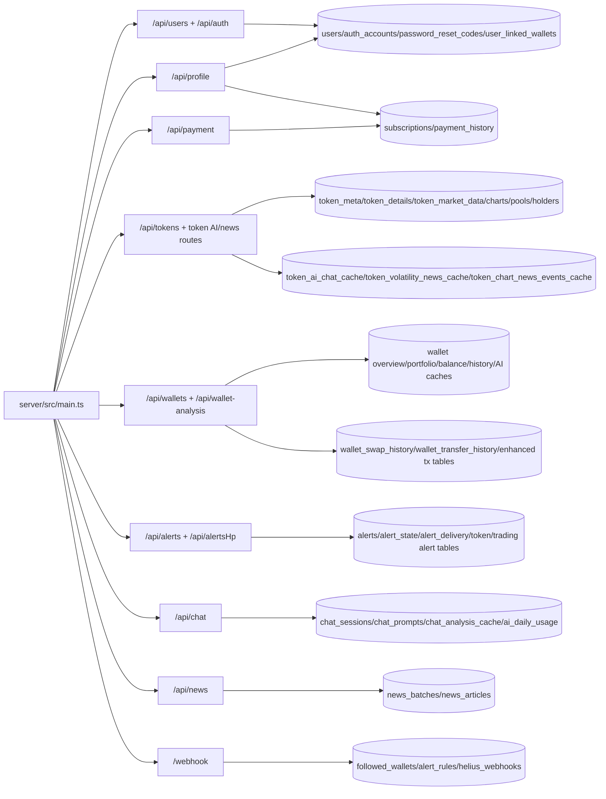
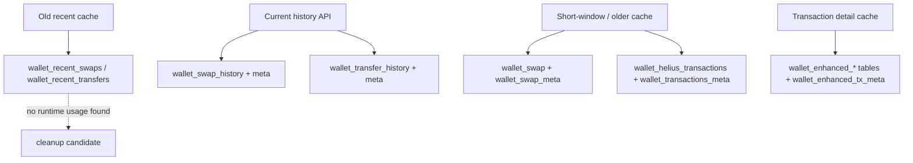

# DB schema usage and cleanup report

Date: 2026-07-08

Scope:

- Server runtime only: `server/src/routes`, `server/src/services`, `server/src/modules`.
- Excluded from active-usage decisions: tests, scripts, seed files, migrations, and schema/type declarations alone.
- This is a planning/report document only. No migration SQL is proposed because the dev database can be rebuilt.

## Summary

The database is mostly an application cache and user/config store. It is not a strongly relational domain model, even though some user/payment/alert tables use foreign keys.

The active schema has these major areas:

- User/auth/profile config: `users`, `auth_accounts`, linked wallets, watchlists, wallet labels, password reset codes.
- Payment/subscription: `subscriptions`, `payment_history`, plus `users.stripe_customer_id`.
- Token cache: token metadata, market data, chart caches, pool caches, holder caches, token AI/news caches.
- Wallet cache/history: current wallet overview/portfolio/history/cache tables, Mobula history tables, Helius transaction detail tables, AI wallet caches.
- Alerts: two active systems exist at the same time: generic token/trading alert tables in `db/alerts.ts`, and webhook-followed wallet alert rules in `schema.ts`.
- Chat/AI/news: chat sessions/prompts/cache, AI usage counter, token/news caches, news batches/articles.

Main cleanup findings:

- The confirmed runtime-unused and seed-only tables identified during this audit have been removed.
- The schema split is incomplete: `schema.ts` still owns most token, wallet, news, alert-rule, and chat tables.

## Runtime DB Map



## Active Tables By Module

### User, Auth, Profile Config

| Table | Module/services | Related endpoints | Usage |
| --- | --- | --- | --- |
| `users` | `services/users.ts`, `subscription.service.ts`, `followedWallets.service.ts`, payment route | `/api/users/*`, `/api/auth/*`, `/api/profile/settings`, `/api/alerts/settings`, `/api/payment/*` | Primary user row. Also stores Discord/email alert settings and Stripe customer id. |
| `auth_accounts` | `services/users.ts` | `/api/users/auth/*`, `/api/auth/*`, `/api/profile/settings/password`, account delete | Password, Google/GitHub/Solana auth account identities. |
| `password_reset_codes` | `services/users.ts` | password reset endpoints under users/auth | Password reset code storage. |
| `user_linked_wallets` | `services/profile/linkedWallet.service.ts`, `services/users.ts` | `/api/profile/linked-wallets*` | User-owned/auth-linked wallets. |
| `user_token_watch_list` | `services/profile/watchlist.service.ts` | `/api/profile/watchlist/tokens*` | Token watchlist. |
| `user_wallet_watch_list` | `services/profile/watchlist.service.ts` | `/api/profile/watchlist/addresses*` | Wallet watchlist. |
| `user_wallet_labels` | `services/profile/walletLabels.service.ts` | `/api/profile/wallet-labels` | User labels for wallet addresses. |

Notes:

- These are the closest thing to core relational tables.
- `users` has alert-delivery settings mixed into the user table; acceptable for now, but if alerts grow, split delivery settings later.

### Payment And AI Usage

| Table | Module/services | Related endpoints | Usage |
| --- | --- | --- | --- |
| `subscriptions` | `subscription.service.ts`, `ai-usage.service.ts`, `payment.route.ts`, `stripe-webhook.ts` | `/api/payment/*`, `/api/profile/subscriptions*`, `/api/chat`, `/api/token-ai-chat`, wallet AI routes | Stripe subscription state and AI tier lookup. |
| `payment_history` | `subscription.service.ts`, `payment.route.ts`, `stripe-webhook.ts` | `/api/payment/*`, `/api/profile/payment-history` | Invoice/payment history. |
| `ai_daily_usage` | `ai-usage.service.ts` | AI-gated routes: chat, token AI, token news summary, wallet AI, wash trading AI | Daily per-user feature usage counter. |

### Token Cache

| Table | Module/services | Related endpoints | Usage |
| --- | --- | --- | --- |
| `token_meta` | `token-info.ts`, `walletPortfolio.service.ts`, `chat-token-search.ts`, wallet history enrichment | `/api/tokens/meta/:addresses`, wallet portfolio/history, chat token search | Name/symbol/image cache. |
| `token_details` | `token-info.ts` | `/api/tokens/details/:addresses` | Detailed token metadata from CoinGecko/Moralis. |
| `token_market_data` | `token-info.ts`, `token-market-data.ts` | `/api/tokens/markets/:addresses` | Market snapshot cache. |
| `coin_gecko_token_list_meta`, `coin_gecko_token_list` | `token-list.ts` | token metadata/chart/market lookup internals | CoinGecko id lookup cache. |
| `zerion_token_list` | `walletTokenBalance.service.ts` | wallet token balance history internals | Zerion id lookup cache. |
| `token_market_chart_24h` | `token-chart.ts` | `/api/tokens/markets/chart/:address` | 24h chart cache. |
| `token_market_chart_hourly` | `token-chart.ts` | `/api/tokens/markets/chart/:address/hourly` | Hourly chart cache up to 90 days. |
| `token_market_chart_daily` | `token-chart.ts`, `news.service.ts` | `/api/tokens/markets/chart/:address/daily`, `/api/tokens/history/:address`, news expansion | Daily chart cache; also used as news context. |
| `token_pool_data`, `token_tops_pool` | `token-pools.ts` | `/api/tokens/:address/pools`, `/api/tokens/pools/:addresses` | Token pool cache and top-pool ranking. |
| `pool_trades_24h` | `token-trades.ts` | `/api/tokens/pools/trades/:address` | Pool trade cache. |
| `trending_tokens` | `token-trending.ts` | `/api/tokens/trending` | Trending token cache. |
| `top_tokens_by_marketcap` | `token-top-marketcap.ts` | `/api/tokens/top-marketcap` | Market cap leaderboard cache. |
| `token_holder_stats`, `top_token_holders` | `token-holders.ts`, `token-info.ts` | `/api/tokens/holders/stats/:addresses`, `/api/tokens/holders/:address` | Holder snapshot cache. |
| `token_volatility_news_cache` | `token-volatility-news-cache.ts` | `/api/token-volatility-news` | Volatility-event news response cache. |
| `token_chart_news_events_cache` | `token-chart-news-events-cache.ts` | `/api/token-chart-news-events` | Chart news event response cache. |
| `token_ai_chat_cache` | `token-ai-chat-cache.ts` | `/api/token-ai-chat` | Token AI answer cache. |

### Wallet Cache, History, Transactions

| Table | Module/services | Related endpoints | Usage |
| --- | --- | --- | --- |
| `wallet_overview_cache` | `walletDataCacher.ts`, `walletDataRetriever.ts`, `walletOverview.service.ts` | `/api/wallets/overview` | Wallet overview cache. |
| `wallet_portfolio_cache` | `walletPortfolio.service.ts` | `/api/wallets/portfolio`, wallet AI dependencies | Current portfolio cache. |
| `wallet_historical_portfolio_cache` | `walletHistoricalPortfolio.service.ts` | chart/PnL/history flows that need date snapshots | Historical portfolio snapshot cache. |
| `wallet_balance_history` | `walletCharts.service.ts` | wallet balance/PnL chart routes | Wallet total balance history cache. |
| `wallet_token_balance_week_history`, `wallet_token_balance_month_history` | `walletTokenBalance.service.ts` | `/api/wallets/:address/tokens` and chart/token-balance flows | Token-level wallet balance history by period. |
| `wallet_analyses` | `wallet-analysis.ts` | `/api/wallets/analysis/winrate`, `/api/wallets/analysis/pnl` | Mobula winrate/PnL analysis cache. |
| `wallet_swap_history`, `wallet_swap_history_meta` | `walletTransfersSwaps.service.ts` | `/api/wallets/swaps/history/:address` | Current paginated swap history cache and range coverage. |
| `wallet_transfer_history`, `wallet_transfer_history_meta` | `walletTransfersSwaps.service.ts` | `/api/wallets/transfers/history/:address` | Current paginated transfer history cache and range coverage. |
| `wallet_swap`, `wallet_swap_meta` | `walletDataCacher.ts`, `walletDataRetriever.ts`, wallet transfer/swap service | `/api/wallets/swap`, wallet AI/chat flows | Older/current short-window swap cache. Still active. |
| `wallet_transactions`, `wallet_transactions_meta` | `walletDataRetriever.ts`, `wash-trading.service.ts`, transaction distribution | chart/transaction/wash-trading flows | Transaction cache. Still referenced. |
| `wallet_helius_transactions` | `walletDataCacher.ts`, `walletDataRetriever.ts`, `walletHistory.service.ts` | wallet history/internal Helius cache | Helius raw transaction history cache. |
| `wallet_enhanced_transactions`, `wallet_enhanced_token_transfers`, `wallet_enhanced_native_transfers`, `wallet_enhanced_instructions`, `wallet_enhanced_inner_instructions`, `wallet_enhanced_tx_meta` | `wallet/providers/walletEnhancedTx.service.ts`, day activity/detail services | `/api/wallets/day-activity`, `/api/wallets/tx-detail`, `/api/wallets/tx-instructions` | Helius enhanced transaction detail cache. |
| `wallet_identity_cache` | `walletIdentityCache.ts`, `walletIdentity.service.ts` | `/api/wallets/identity`, `/api/wallets/intelligence`, wallet AI dependency | Wallet identity cache. |
| `wallet_ai_analysis_cache` | `walletAnalysisCache.ts`, `walletAnalysis.service.ts` | `/api/wallets/ai-analysis` | Wallet AI analysis cache. |
| `wallet_audit_cache` | `walletAudit.service.ts` | `/api/wallets/:address/audit` | Forensic audit cache. |
| `wallet_ai_swap_summary_cache` | `walletAiSwapSummary.service.ts` | `/api/wallets/ai-swap-summary` | Wallet swap AI summary cache. |
| `wallet_token_details` | `wallet-token-details.ts` | `/api/wallets/:address/tokens` | Token-level trading/PnL details per wallet. |
| `wallet_first_fund` | `walletFirstFund.service.ts`, `walletDataCacher.ts` | `/api/wallets/first-funds/:address`, wallet AI dependency | First funding transaction cache. |
| `wallet_pnl_data_cache`, `wallet_pnl_data_meta` | `walletDataCacher.ts`, chart/PnL services | wallet chart/PnL flows | Daily PnL cache and coverage metadata. |
| `wallet_user_tags` | `walletTags.ts` | `/api/wallets/tags` | User tags for wallet addresses. |

Wallet cache generations:



### Alerts

There are two active alert systems.

| Table | Module/services | Related endpoints | Usage |
| --- | --- | --- | --- |
| `alerts`, `alert_state`, `alert_delivery` | `services/alerts/alerts-token.ts`, `services/alerts/alerts-trading.ts` | `/api/alertsHp/tokens/*`, `/api/alertsHp/trading/*` | Generic token/trading alert definitions, state, delivery. |
| `token_alert_targets`, `token_alert_conditions` | same as above | `/api/alertsHp/tokens/*` | Token alert target and predicates. |
| `trading_alert_scopes`, `trading_alert_conditions` | same as above | `/api/alertsHp/trading/*` | Trading alert scope and predicates. |
| `wallet_metrics_1m` | `token-data-polling.ts`, `wallet-transaction-alert.ts` | internal alert evaluation | Aggregated wallet metric buckets. |
| `followed_wallets` | `followedWallets.service.ts` | `/api/alerts` | Followed wallets for webhook monitoring. |
| `alert_rules` | `alertRules.service.ts`, webhook alert processing | `/api/alerts/rules`, `/webhook` | User-defined webhook alert predicates. |
| `helius_webhooks`, `helius_webhook_addresses` | `heliusWebhooks.service.ts`, alert route diagnostics/sync | `/api/alerts/diagnostics`, `/api/alerts`, `/webhook` | Managed Helius webhook shards and address membership. |

Recommendation: do not delete either alert system blindly. First decide product direction:

- If `/api/alertsHp` is an old prototype, migrate any required behavior into `/api/alerts`, then remove generic alert tables.
- If `/api/alertsHp` is the intended replacement, port webhook address sync/delivery behavior into the generic tables, then retire `followed_wallets` and `alert_rules`.

### Chat, AI, News

| Table | Module/services | Related endpoints | Usage |
| --- | --- | --- | --- |
| `chat_sessions` | `chat-session.ts` | `/api/chat`, `/api/chat/sessions*` | Persisted user chat sessions. |
| `chat_prompts` | `chat-prompts.ts` | `/api/chat/prompts*` | User/public prompt templates. |
| `chat_analysis_cache` | `chat.cache.ts` | `/api/chat` | Wallet chat response cache. |
| `news_batches`, `news_articles` | `news.service.ts` | `/api/news/webhook`, `/api/news/articles/:contentHash/expand` | n8n/news ingestion and article expansion. |

## Completed Cleanup

| Removed table | Removed code |
| --- | --- |
| `token_price_cache` | Unreachable `wallet/providers/resolve-token-price.ts`, its unused post-enrichment callers, and related schema types. |
| `token_market_chart_30d` | Unused schema declaration. Active chart code continues to use the 24h, hourly, and daily caches. |
| `token_transfers` | Unused transfer-cache writer/readers and related schema type. Current wallet history uses the paginated transfer-history tables. |
| `wallets` | Unused standalone root table; active wallet tables store wallet addresses directly. |
| `wallet_transfer_meta` | Obsolete metadata companion for `token_transfers`, including unused metadata helpers and freshness branch. |
| `wallet_token_balance_history` | Unused unified token-balance history table; active code uses week/month tables. |
| `wallet_recent_swaps`, `wallet_recent_transfers` | Superseded recent caches; active history uses the paginated swap/transfer history tables. |
| `user_sources` | Unused user-source preference table and inferred schema type. |
| `alert_history`, `trading_alert_webhooks` | Unused generic-alert history and webhook tables, including the `alerts_sent` alias. |
| Trading strategy and wallet-category dictionary tables | Seven seed-only tables, their dedicated seed file, and `db:seed` scripts. |
| `wallet_balances` | Unused legacy wallet balance table removed before this cleanup batch. |

## Runtime-Unused Or Cleanup Candidate Tables

The previously confirmed candidates are recorded under Completed Cleanup. `wallet_metrics_1m` remains pending a separate symbol-level audit because its reported consumers are themselves unreachable.

## Deprecated Or Overlapping Areas

### Wallet Transfers/Swaps

Current active history endpoints:

- `GET /api/wallets/swaps/history/:address`
- `GET /api/wallets/transfers/history/:address`

Current active history tables:

- `wallet_swap_history`
- `wallet_swap_history_meta`
- `wallet_transfer_history`
- `wallet_transfer_history_meta`

The deprecated recent swap/transfer tables have been removed. Keep the active history tables and their metadata tables.

### Alerts

`/api/alerts` and `/api/alertsHp` are both mounted. Their tables overlap conceptually but not structurally.

Cleanup should wait for a product decision. Removing one without endpoint consolidation will break active routes.

### Wallet Transaction Caches

There is overlap between:

- `wallet_swap` short-window cache.
- `wallet_swap_history` / `wallet_transfer_history` paginated history caches.
- `wallet_helius_transactions` and `wallet_enhanced_*` transaction detail caches.

Do not remove the older active swap cache yet. It is still referenced by wallet data retriever/cacher and chat/AI fingerprint paths. A later refactor can unify reads on the history/enhanced tables.

## Cleanup Plan

Phase 1 is complete: confirmed unused tables and seed-only dictionaries were removed from the schema.

Phase 2: decide alert system direction.

- Pick `/api/alerts` or `/api/alertsHp` as canonical.
- Migrate any required behavior.
- Remove the losing endpoint group and its tables.

Phase 3: simplify wallet cache generations.

- Keep current history tables as the canonical transfer/swap history store.
- Audit `wallet_swap` and `wallet_helius_transactions` call paths.
- Move remaining consumers to the canonical history/enhanced transaction tables before deleting older caches.

## Recommended DB Schema File Split

Keep `server/src/db/schema.ts` as a barrel only, or make it small enough to export shared enums and re-export modules. Move table definitions into domain files.

Recommended files:

```text
server/src/db/
  index.ts
  schema.ts                 # barrel re-export only
  users.ts                  # already exists
  payment.ts                # already exists
  alerts.ts                 # generic /api/alertsHp system, already exists
  alert-rules.ts            # followed wallets, alert_rules, helius webhook tables
  tokens.ts                 # token meta/details/market/chart/pool/holder/trending/top marketcap
  token-ai.ts               # token_ai_chat_cache, token volatility/chart news caches
  wallets.ts                # active wallet history/balance/analysis tables, already partially exists
  wallet-cache.ts           # overview/portfolio/current cache tables if wallets.ts gets too large
  wallet-transactions.ts    # wallet_helius_transactions, wallet_enhanced_* tables
  wallet-ai.ts              # wallet identity/AI/audit/swap summary/first fund/token details
  chat.ts                   # chat_sessions, chat_prompts, chat_analysis_cache
  news.ts                   # news_batches, news_articles
  meta.ts                   # CoinGecko/Zerion lookup caches, already exists
```

Suggested ownership after cleanup:

| Module file | Tables |
| --- | --- |
| `users.ts` | `users`, `auth_accounts`, `password_reset_codes`, `user_linked_wallets`, `user_token_watch_list`, `user_wallet_watch_list`, `user_wallet_labels` |
| `payment.ts` | `subscriptions`, `payment_history`, payment enums |
| `tokens.ts` | `token_meta`, `token_details`, `token_market_data`, chart tables, pool tables, holder tables, trending/top tables, trade tables |
| `token-ai.ts` | `token_ai_chat_cache`, `token_volatility_news_cache`, `token_chart_news_events_cache`, `ai_daily_usage` if AI usage is not moved to `users.ts` |
| `wallets.ts` | `wallet_balance_history`, token balance week/month, wallet analyses, swap/transfer history and meta |
| `wallet-cache.ts` | overview, portfolio, historical portfolio, PnL cache/meta |
| `wallet-transactions.ts` | `wallet_transactions`, `wallet_transactions_meta`, `wallet_helius_transactions`, `wallet_enhanced_*`, `wallet_swap`, `wallet_swap_meta` |
| `wallet-ai.ts` | identity cache, AI analysis cache, audit cache, AI swap summary cache, token details, first fund, user tags |
| `alert-rules.ts` | `followed_wallets`, `alert_rules`, `helius_webhooks`, `helius_webhook_addresses` |
| `alerts.ts` | generic alerts tables only |
| `chat.ts` | chat tables |
| `news.ts` | news tables |
| `meta.ts` | external id lookup caches |

Restructure order:

1. Remove dead tables first so they do not get moved.
2. Move tables by runtime ownership, not by old file location.
3. Keep existing table export names unchanged during the move.
4. Keep `schema.ts` re-exporting every module so imports from `@sv/db/schema.js` keep working.
5. After imports are stable, optionally update services to import from narrower modules.

## Suggested Diagram For Senior Dev Review

```mermaid
erDiagram
  users ||--o{ auth_accounts : owns
  users ||--o{ user_linked_wallets : links
  users ||--o{ user_token_watch_list : watches
  users ||--o{ user_wallet_watch_list : watches
  users ||--o{ user_wallet_labels : labels
  users ||--o{ subscriptions : pays
  subscriptions ||--o{ payment_history : invoices 
  users ||--o{ ai_daily_usage : consumes

  users ||--o{ followed_wallets : follows
  users ||--o{ alert_rules : configures
  helius_webhooks ||--o{ helius_webhook_addresses : covers

  users ||--o{ alerts : owns
  alerts ||--o{ alert_state : state
  alerts ||--o{ alert_delivery : delivery
  alerts ||--o{ token_alert_targets : targets
  alerts ||--o{ token_alert_conditions : predicates
  alerts ||--o{ trading_alert_scopes : scopes
  alerts ||--o{ trading_alert_conditions : predicates

  token_meta ||--o{ token_market_data : enriches
  token_meta ||--o{ token_market_chart_daily : charts
  token_meta ||--o{ token_pool_data : pools
  token_meta ||--o{ token_holder_stats : holders

  wallet_swap_history ||--|| wallet_swap_history_meta : coverage
  wallet_transfer_history ||--|| wallet_transfer_history_meta : coverage
  wallet_enhanced_transactions ||--o{ wallet_enhanced_token_transfers : details
  wallet_enhanced_transactions ||--o{ wallet_enhanced_native_transfers : details
  wallet_enhanced_transactions ||--o{ wallet_enhanced_instructions : details
```



## Files Reviewed

Primary schema files:

- `server/src/db/schema.ts`
- `server/src/db/users.ts`
- `server/src/db/wallets.ts`
- `server/src/db/payment.ts`
- `server/src/db/alerts.ts`
- `server/src/db/meta.ts`
- `server/src/db/index.ts`

Primary runtime entry/routes:

- `server/src/main.ts`
- `server/src/routes/users.ts`, `auth.ts`, `profile.ts`
- `server/src/routes/tokens.ts`, `token-ai-chat.ts`, `token-volatility-news.ts`, `token-chart-news-events.ts`
- `server/src/routes/wallets.ts`, `routes/wallets/wallet-analysis.ts`, `routes/wallets/wallet-tags.ts`
- `server/src/routes/alerts.route.ts`, `routes/alerts.ts`, `routes/alerts/*`
- `server/src/routes/payment.route.ts`, `stripe-webhook.ts`
- `server/src/routes/chat.route.ts`
- `server/src/routes/news.ts`
- `server/src/routes/webhook.ts`

Primary runtime services:

- `server/src/services/users.ts`
- `server/src/services/subscription.service.ts`
- `server/src/services/ai-usage.service.ts`
- `server/src/services/tokens/*`
- `server/src/services/wallet/*`
- `server/src/services/wallet/db/*`
- `server/src/services/wallet/providers/*`
- `server/src/services/alerts/*`
- `server/src/services/alertRules.service.ts`
- `server/src/services/followedWallets.service.ts`
- `server/src/services/heliusWebhooks.service.ts`
- `server/src/services/chat/*`
- `server/src/services/news.service.ts`
