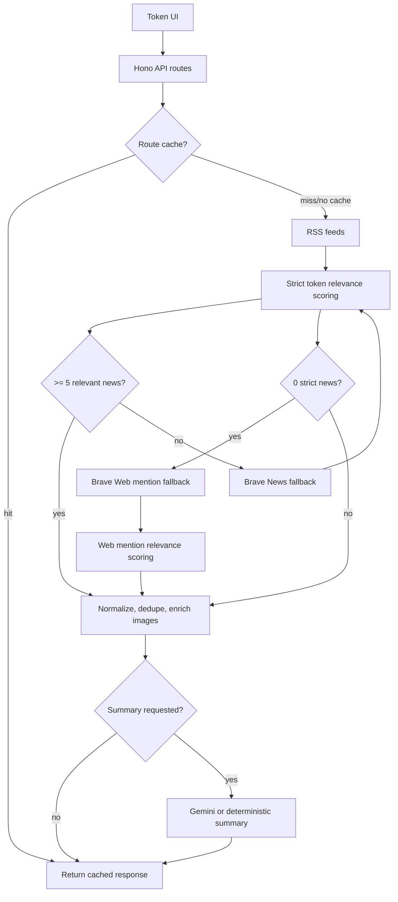
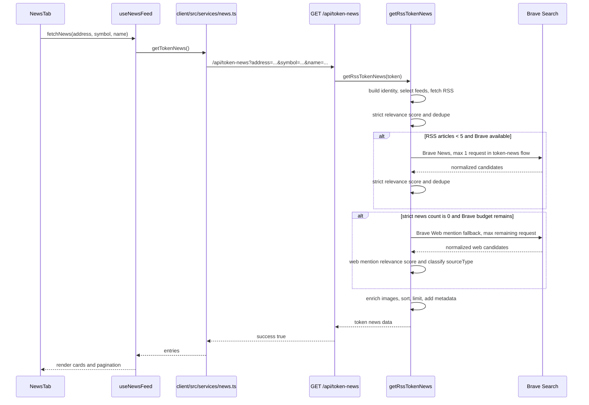
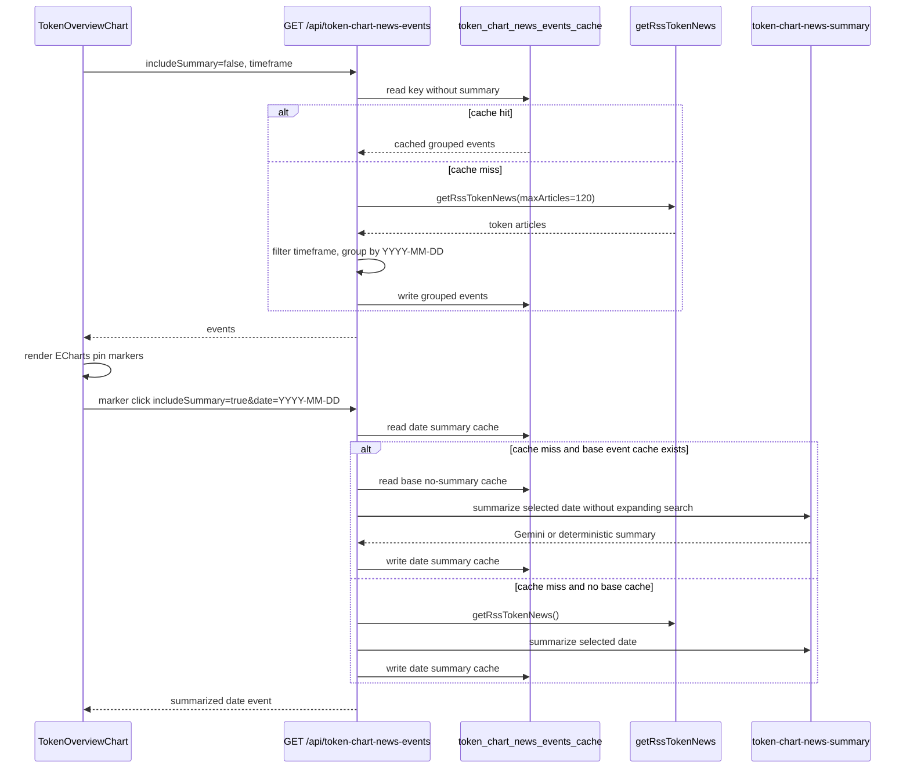
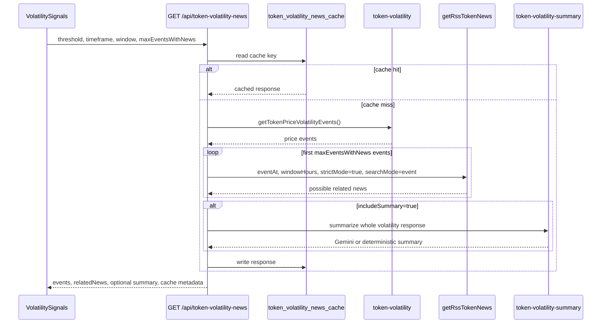

# RSS_BRAVE_NEWS

## Overview

Yoca's current token news system retrieves token-specific articles from RSS first, then uses Brave Search as a bounded fallback when RSS coverage is too thin. The system powers:

- The token page `News & Updates` cards.
- Address-only chart news markers on `/tokens/:address`.
- Possible related news for volatility signals on `/tokens/:address/:poolAddress`.
- News context that can be reused by token AI chat and summaries.

The core goals are:

- Prefer reliable RSS sources before paid or quota-limited Brave calls.
- Keep strict token relevance matching so unrelated token mentions do not pollute results.
- Support low-news tokens with cautious web-mention fallback without pretending every mention is major news.
- Keep AI summary generation optional, cached where possible, and non-causal.
- Preserve provider metadata so the UI can distinguish RSS news, Brave news, web mentions, and project updates.

Why RSS + Brave:

- RSS is free, cache-friendly, and stable for broad crypto coverage.
- Brave News improves coverage when RSS has too few token-specific results.
- Brave Web is used only as a final fallback for low-news tokens, and those results are marked as `web_mention` or `project_update`.
- Gemini summaries are optional context, not the retrieval source.



## Current Architecture

Backend:

- Framework: Hono.
- Main route mounting: `server/src/main.ts`.
- Current token news entry point: `GET /api/token-news`.
- Chart marker route: `GET /api/token-chart-news-events`.
- Volatility plus possible related news route: `GET /api/token-volatility-news`.
- RSS parser: `rss-parser`.
- Brave client: direct `fetch`.
- Gemini client: `@google/genai`, optional via `GOOGLE_AI_KEY`.
- Persistence: Drizzle/Postgres cache tables for chart news events and volatility-news responses.

Frontend:

- API client: Hono typed client in `client/src/api/main.ts`.
- Token news service: `client/src/services/news.ts`.
- News cards: `client/src/components/token/NewsTab.tsx` and `NewsCard.tsx`.
- Chart markers: `client/src/components/token/TokenOverviewChart.tsx`.
- Volatility panel: `client/src/components/token/VolatilitySignals.tsx`.

Important routing split:

- `/tokens/:address` uses the custom `TokenOverviewChart` and can display chart news markers.
- `/tokens/:address/:poolAddress` uses the GeckoTerminal iframe chart and displays `VolatilitySignals`; it does not draw markers inside GeckoTerminal.

## Component Inventory

### Backend Routing

| File | Role |
|---|---|
| `server/src/main.ts` | Mounts `/api/token-news`, `/api/token-chart-news-events`, `/api/token-volatility-news`, and `/api/news`. |
| `server/src/routes/token-news.ts` | Validates `address`, `symbol`, `name`; calls `getRssTokenNews`; returns raw token news response. |
| `server/src/routes/token-chart-news-events.ts` | Groups token news by UTC date for chart markers, supports date-specific lazy summary, and uses DB cache. |
| `server/src/routes/token-volatility-news.ts` | Runs volatility detection, attaches possible related news per event, optionally adds summary, and uses DB cache. |
| `server/src/routes/news.ts` | Separate active `/api/news` expansion/webhook route backed by `news.service.ts`; not the current NewsTab RSS/Brave path. |

### Backend News Services

| File | Role |
|---|---|
| `server/src/services/rss-news.service.ts` | Main RSS + Brave aggregation service, identity normalization, feed selection, strict scoring, dedupe, image enrichment, event context, provider metadata. |
| `server/src/services/brave-news.service.ts` | Brave News and Brave Web client, query construction, usage guard, endpoint calls, result normalization. |
| `server/src/services/tokens/token-chart-news-summary.ts` | Chart-marker summary generation with cleaned article text, Gemini optional summary, deterministic fallback. |
| `server/src/services/tokens/token-volatility-summary.ts` | Volatility signal summary generation with Gemini optional summary and deterministic fallback. |
| `server/src/services/tokens/token-chart-news-events-cache.ts` | DB cache read/write/TTL helpers for chart news marker events. |
| `server/src/services/tokens/token-volatility-news-cache.ts` | DB cache read/write/TTL helpers for volatility-news responses. |
| `server/src/services/news.service.ts` | Separate news batch/expansion service using `news_batches` and `news_articles`; currently separate from the RSS/Brave token news path. |
| `server/src/services/tokens/token-ai-context.ts` | Builds token AI context, including news-related context where needed. |
| `server/src/services/tokens/token-ai-chat.service.ts` | Token AI chat service; can consume news/marker/volatility context. |
| `server/src/services/chat/chat-web-search.ts` | Separate Brave web-search consumer for chat, not the token News & Updates pipeline. |

### Backend Types and Schema

| File | Role |
|---|---|
| `server/src/db/schema.ts` | Defines `token_volatility_news_cache`, `token_chart_news_events_cache`, `news_batches`, `news_articles`, and related tables. |
| `server/src/types/news.schema.ts` | Validation/types for the separate `/api/news` expansion/webhook route. |
| `server/src/types/news.types.ts` | Re-exports `/api/news` types. |
| `server/src/middlewares/validation.ts` | Env validation, including Brave and Gemini env variables. |
| `server/src/config/constants.ts` | Shared constants including `WALLET_AUDIT_MODEL`, `GOOGLE_AI_KEY`, and separate `/api/news` cache constants. |

### Frontend Services and Types

| File | Role |
|---|---|
| `client/src/api/main.ts` | Typed Hono client definitions for news-related API routes. |
| `client/src/services/news.ts` | `getTokenNews()` for `/api/token-news`; maps backend articles to frontend news cards. |
| `client/src/hooks/useNewsFeed.ts` | Local loading/error state for token News & Updates. |
| `client/src/services/tokenChartNewsEvents.ts` | `getTokenChartNewsEvents()` for chart marker events and lazy summaries. |
| `client/src/services/tokenVolatility.ts` | `getTokenVolatilityNews()` for volatility plus possible related news. |
| `client/src/types/news.ts` | News card and token-news response types, including `sourceType`, `imageUrl`, and `favicon`. |
| `client/src/types/chartNewsEvents.ts` | Chart marker event and summary types. |
| `client/src/types/volatility.ts` | Volatility signal, related news, summary, cache, and provider metadata types. |

### Frontend Components

| File | Role |
|---|---|
| `client/src/components/token/NewsTab.tsx` | Loads token news, sorts newest first, paginates 10 per page, displays web-mention notice when relevant. |
| `client/src/components/token/NewsCard.tsx` | Renders article card with thumbnail/fallback, source, title, description, date, and external link. |
| `client/src/components/token/TokenOverviewChart.tsx` | Address-only chart; loads grouped news events, renders ECharts news markers, lazy-loads summary on marker click. |
| `client/src/components/token/VolatilitySignals.tsx` | Pool-specific page panel; loads volatility-news, shows possible related news, optional manual signal summary. |
| `client/src/pages/token-overview/index.tsx` | Address-only page; renders `TokenOverviewChart`, Markets, News tab, and section navigation. |
| `client/src/pages/token/index.tsx` | Pool-specific page; renders GeckoTerminal chart, News tab, and `VolatilitySignals`. |

## End-to-End Data Flow

### News & Updates Tab



### Chart News Markers



### Volatility + Possible Related News



## RSS Feed System

RSS feeds are defined in `server/src/services/rss-news.service.ts` as structured config objects:

| Source | URL | Category |
|---|---|---|
| Cointelegraph | `https://cointelegraph.com/rss` | `general` |
| Decrypt | `https://decrypt.co/feed` | `general` |
| CryptoSlate | `https://cryptoslate.com/feed/` | `general` |
| CoinDesk | `https://www.coindesk.com/arc/outboundfeeds/rss/` | `general` |
| BeInCrypto | `https://beincrypto.com/feed/` | `general` |
| CryptoBriefing | `https://cryptobriefing.com/feed/` | `general` |
| Blockworks | `https://blockworks.co/feed` | `general` |
| The Block | `https://www.theblock.co/rss.xml` | `general` |
| Bitcoin Magazine | `https://bitcoinmagazine.com/.rss/full/` | `bitcoin` |
| Solana Blog | `https://solana.com/news/rss.xml` | `solana` |
| Binance Announcements | `https://www.binance.com/en/support/announcement/rss` | `exchange` |
| Coinbase Blog | `https://www.coinbase.com/blog/rss` | `exchange` |

Feed selection:

- General, exchange, and DeFi feeds are always eligible.
- Bitcoin Magazine is selected only for BTC/Bitcoin/Wrapped Bitcoin identities.
- Solana Blog is selected for Solana or known Solana ecosystem symbols.
- Known Solana ecosystem symbols are currently `SOL`, `JUP`, `PYTH`, `BONK`, `WIF`, `RAY`, `JTO`, `ORCA`, and `HNT`.

RSS fetch behavior:

- Timeout: `RSS_FETCH_TIMEOUT_MS = 12_000`.
- Feed failures are collected and logged, but do not fail the whole request.
- Raw RSS fields are normalized into an internal `RawNewsArticle`.
- Image extraction checks RSS enclosure/media fields before using page-level OpenGraph fallback.

## Brave Search Integration

Brave is implemented in `server/src/services/brave-news.service.ts`.

Endpoints:

- Brave News: `https://api.search.brave.com/res/v1/news/search`
- Brave Web: `https://api.search.brave.com/res/v1/web/search`

Request settings:

- `count=10`
- `country=US`
- `search_lang=en`
- Timeout: `BRAVE_SEARCH_TIMEOUT_MS = 10_000`
- Header: `X-Subscription-Token: BRAVE_SEARCH_API_KEY`

Usage guard:

- Brave must be explicitly enabled with `BRAVE_SEARCH_ENABLED=true`.
- Missing `BRAVE_SEARCH_API_KEY` skips Brave gracefully.
- `BRAVE_MONTHLY_SOFT_LIMIT` is optional.
- `BRAVE_MONTHLY_USED_OFFSET` is added to the in-process Brave call counter.
- Effective usage is:

```text
effectiveBraveUsage = BRAVE_MONTHLY_USED_OFFSET + currentProcessBraveCalls
```

- If `effectiveBraveUsage >= BRAVE_MONTHLY_SOFT_LIMIT`, Brave is skipped.
- The in-process counter resets when the server process restarts.

Query limits:

- `MAX_BRAVE_QUERIES = 2`.
- Token-news flow currently calls Brave News with `maxRequests: 1`.
- If strict RSS + Brave News returns zero and a Brave request remains, Brave Web mention fallback can use the remaining request.
- Chart/event contexts use bounded query variants, but route caches are checked before expensive summary/date work.

Brave News query variants:

- Token mode:
  - `"Token Name" "SYMBOL" crypto news`
  - `"Token Name" "SYMBOL" Solana news` for Solana ecosystem tokens
  - `"Token Name" token latest news`
- Event/chart mode:
  - `"Token Name" "SYMBOL" crypto news Month Day Year`
  - `"Token Name" "SYMBOL" update Month Year`
  - Optional Solana context query for Solana ecosystem tokens

Brave Web fallback query variants:

- `"Token Name" "SYMBOL" Solana OR crypto OR pump.fun OR "meme coin"`
- `"mintAddress" crypto` only if budget remains.

Brave is called when:

- RSS relevant article count is below `BRAVE_MIN_ARTICLES_BEFORE_FALLBACK = 5`.
- Brave is enabled and under the soft limit.
- `allowBrave` was not disabled by caller options.

Brave is skipped when:

- RSS already returns at least 5 relevant articles.
- `BRAVE_SEARCH_ENABLED` is not `true`.
- `BRAVE_SEARCH_API_KEY` is missing.
- Effective Brave usage has reached the soft limit.
- Caller passes `allowBrave: false`.

## News Aggregation Logic

### Token Identity Normalization

`buildTokenNewsIdentity()` returns:

```ts
{
  address,
  originalName,
  originalSymbol,
  normalizedSymbol,
  searchNames,
  searchSymbols
}
```

Rules:

- Symbol is trimmed, `$` is removed, and uppercase is used for matching.
- Wrapped/native aliases are handled explicitly for BTC, ETH, and SOL.
- Wrapped SOL mint `So11111111111111111111111111111111111111112` maps to Solana/SOL search aliases.
- Search aliases affect matching and feed selection; the response still carries the token identity used by the request.

### Strict Article Scoring

The strict scoring function uses title and description as primary evidence. It does not use full RSS `contentEncoded` as normal relevance evidence.

Strong evidence:

- Token name alias in title.
- Token name alias in description.
- `$SYMBOL` in title.
- `$SYMBOL` in description.

Weak evidence:

- Bare symbol as a word in title or description.
- Full body/content mentions are treated only as diagnostic content-only matches and are not enough to pass.

Acceptance:

- `MIN_RELEVANCE_SCORE = 4`.
- `hasStrongMatch` must be true.
- Event keyword boosts only apply after a strong title/description match.
- Ambiguous names such as `jupiter`, `hyper`, `near`, `render`, `ray`, and `orca` require crypto context.

Current score signals include:

- Name title: `+5`
- Name description: `+4`
- Cashtag title: `+5`
- Cashtag description: `+4`
- Bare symbol title: `+1`
- Bare symbol description: `+1`
- Event keyword boost after strong match: `+1`
- Trusted domain boost after strong match: `+1`
- Weak generic phrases: penalty

`matchedBy` labels are explicit, for example:

- `name-title:Solana`
- `name-description:Solana`
- `cashtag-title:$SOL`
- `cashtag-description:$SOL`
- `symbol-title:SOL`
- `symbol-description:SOL`
- `event:listing`

### Low-News Web Mention Fallback

If strict RSS + Brave News results are zero, the service may use Brave Web fallback.

Web fallback does not weaken normal news matching. It uses a separate web mention scorer and classification:

- `sourceType: "news"` for RSS, Brave News, and trusted news domains.
- `sourceType: "web_mention"` for broader web results.
- `sourceType: "project_update"` for detected project, official, social, blog, or community domains.

Web mention acceptance requires at least one of:

- Exact token name match.
- Exact symbol with crypto/Solana context.
- Mint address match.

Generic non-crypto results are rejected.

Trusted domain boost includes:

- `coindesk.com`
- `cointelegraph.com`
- `decrypt.co`
- `blockworks.co`
- `cryptoslate.com`
- `beincrypto.com`
- `cryptobriefing.com`
- `theblock.co`
- `solana.com`
- `jup.ag`

Project/update domain detection includes domains such as:

- `x.com`
- `twitter.com`
- `medium.com`
- `mirror.xyz`
- `paragraph.xyz`
- `substack.com`
- `pump.fun`
- `t.me`
- `telegram.me`
- `discord.gg`
- `discord.com`

### Deduplication and Sorting

Deduplication is applied by:

1. Normalized URL.
2. Normalized title.

When duplicates exist, the higher-scoring article is kept.

Final sorting:

- Dated articles first, newest to oldest.
- Missing or invalid dates after dated articles.
- Score used as secondary sorting where relevant.

### Image Enrichment

Article image fields:

- `imageUrl?: string | null`
- `favicon?: string | null`

RSS image priority:

1. Image enclosure URL.
2. `media:content` URL.
3. `media:thumbnail` URL.
4. `itunes:image`.
5. First image in RSS content/contentEncoded when safe.
6. OpenGraph fallback for top missing-image candidates.
7. Favicon fallback.

OpenGraph fallback:

- Only runs for up to `MAX_OPEN_GRAPH_IMAGE_FETCHES = 10` articles.
- Timeout: `OPEN_GRAPH_FETCH_TIMEOUT_MS = 4_000`.
- Uses in-memory OpenGraph image cache with TTL `6h`.
- Accepts only safe `http` or `https` URLs.
- Converts relative image URLs to absolute using the article URL.
- Does not fail the news request if extraction fails.

## News Marker Retrieval

Chart news markers are implemented only on `/tokens/:address`, not on the pool-specific GeckoTerminal page.

Endpoint:

```text
GET /api/token-chart-news-events?address=...&symbol=...&name=...&timeframe=24h|7d|1m|3m|1y&includeSummary=false
```

Behavior:

- Calls `getRssTokenNews({ maxArticles: 120 })`.
- Filters articles by timeframe:
  - `24h`: last 1 day
  - `7d`: last 7 days
  - `1m`: last 30 days
  - `3m`: last 90 days
  - `1y`: last 365 days
- Groups by UTC date key `YYYY-MM-DD`.
- Returns one marker event per date.
- Sorts events newest first.
- Limits to `MAX_CHART_NEWS_EVENTS = 30`.
- Limits articles per date to `MAX_ARTICLES_PER_EVENT = 10`.

Frontend marker implementation:

- `TokenOverviewChart.tsx` maps each event date to the closest visible chart data point.
- ECharts series type: `scatter`.
- Marker symbol: `pin`.
- Marker size: `34`.
- Marker color: `#f1c21b`.
- Marker label shows `articleCount`.
- Clicking a marker opens a popup and lazy-loads a date-specific summary.

Lazy summary on marker click:

```text
GET /api/token-chart-news-events?address=...&symbol=...&name=...&timeframe=...&date=YYYY-MM-DD&includeSummary=true
```

If a base no-summary cache exists, the route reuses it to summarize only the selected date and avoids expanding the search again. If no base cache exists, it builds fresh events.

## AI Summary / LLM Integration

AI summaries are optional. The system does not call Gemini unless `includeSummary=true` for a route that supports summaries.

### Chart Marker Summary

File: `server/src/services/tokens/token-chart-news-summary.ts`.

Model resolution:

1. `TOKEN_CHART_NEWS_SUMMARY_MODEL`
2. `GEMINI_AUDIT_MODEL`
3. `WALLET_AUDIT_MODEL` from `server/src/config/constants.ts`

API key:

- `GOOGLE_AI_KEY`

If `GOOGLE_AI_KEY` is missing or Gemini fails, the route returns a deterministic fallback summary.

Gemini input includes cleaned:

- `title`
- `source`
- `sourceType`
- `publishedAt`
- `description`
- `extraSnippets`
- `extractedText`
- `url` as reference

Full article text extraction:

- Fetches top `MAX_ARTICLES_WITH_EXTRACTED_TEXT = 5`.
- Timeout: `ARTICLE_FETCH_TIMEOUT_MS = 5_000`.
- Caps extracted text to `ARTICLE_EXTRACTED_TEXT_MAX_CHARS = 1_600`.
- Strips HTML, scripts, style, nav/header/footer/aside/form, boilerplate, repeated title/source noise, duplicate sentences.
- Prefers snippets over extracted text for noisy sources such as Ticker Report and Daily Political.

Summary output:

```ts
{
  headline: string;
  tldr: string;
  bullets: string[];
  themes: string[];
  confidence: "high" | "medium" | "low";
  riskNote: string;
  provider?: string;
  generatedAt: string;
}
```

Rules:

- Summarize from provided titles, snippets, descriptions, and extracted article text only.
- Do not claim price causation.
- Do not predict price.
- Do not provide financial advice.
- If only web mentions are present, use cautious wording.

### Volatility News Summary

File: `server/src/services/tokens/token-volatility-summary.ts`.

Model resolution:

1. `TOKEN_VOLATILITY_SUMMARY_MODEL`
2. `GEMINI_AUDIT_MODEL`
3. `WALLET_AUDIT_MODEL`

API key:

- `GOOGLE_AI_KEY`

Output:

```ts
{
  headline: string;
  bullets: string[];
  riskNote: string;
  generatedAt: string;
  provider?: string;
}
```

The prompt summarizes supplied volatility events and possible related news only. It uses `sourceType` to distinguish normal news from broader web mentions or project updates. It must not claim that news caused a price move.

## Caching Strategy

### `/api/token-news`

Direct token news requests do not currently use a persistent DB response cache.

They do use:

- RSS feed fetch failure isolation.
- In-memory OpenGraph image cache for image fallback.
- Brave usage guard and bounded Brave queries.

This means repeated direct `/api/token-news` calls can still fetch RSS and, when RSS is below threshold, may call Brave if enabled and under budget.

### Chart News Events Cache

Table: `token_chart_news_events_cache`.

Drizzle schema: `server/src/db/schema.ts`.

Cache helper: `server/src/services/tokens/token-chart-news-events-cache.ts`.

Tracked SQL:

- `server/migrations/manual/0005_token_chart_news_events_cache.sql`
- `server/migrations/manual/0006_token_chart_news_events_cache_event_date.sql`

Cache key:

- `token_address`
- `symbol`
- `name`
- `timeframe`
- `event_date`
- `include_summary`

TTL values:

| Timeframe | TTL |
|---|---:|
| `24h` | 30 minutes |
| `7d` | 1 hour |
| `1m` | 2 hours |
| `3m` | 6 hours |
| `1y` | 6 hours |

### Volatility News Cache

Table: `token_volatility_news_cache`.

Drizzle schema: `server/src/db/schema.ts`.

Cache helper: `server/src/services/tokens/token-volatility-news-cache.ts`.

Tracked SQL:

- `server/migrations/manual/0004_token_volatility_news_cache.sql`

Cache key:

- `token_address`
- `threshold_percent`
- `timeframe`
- `detection_window`
- `max_events_with_news`
- `include_summary`

The table stores `symbol` and `name`, but the cache read key does not filter by symbol/name.

TTL values:

| Timeframe | TTL |
|---|---:|
| `24h` | 30 minutes |
| `hourly` | 1 hour |
| `daily` | 6 hours |

### Separate `/api/news` Batch Cache

The separate `server/src/services/news.service.ts` route uses:

- `news_batches`
- `news_articles`
- `NEWS_CACHE_TTL_MS`

That route is not the current RSS/Brave NewsTab path. It remains mounted under `/api/news` for article expansion/webhook behavior.

## API Reference

### `GET /api/token-news`

Main token news endpoint.

Query:

| Param | Required | Notes |
|---|---:|---|
| `address` | yes | Solana base58 token address. |
| `symbol` | yes | Trimmed, max 24 chars. |
| `name` | yes | Trimmed, max 128 chars. |

Success:

```json
{
  "success": true,
  "data": {
    "token": {
      "address": "...",
      "symbol": "SOL",
      "name": "Wrapped SOL"
    },
    "source": "rss+brave",
    "updatedAt": "2026-06-19T00:00:00.000Z",
    "providersUsed": ["rss", "brave"],
    "braveFallbackUsed": true,
    "braveNewsUsed": true,
    "braveWebFallbackUsed": false,
    "sourceTypeCounts": {
      "news": 5,
      "web_mention": 0,
      "project_update": 0
    },
    "articles": [
      {
        "title": "Article title",
        "url": "https://example.com/article",
        "source": "CoinDesk",
        "publishedAt": "2026-06-19T00:00:00.000Z",
        "description": "Short snippet",
        "score": 9,
        "matchedBy": ["name-title:Solana"],
        "sourceType": "news",
        "imageUrl": "https://example.com/image.jpg",
        "favicon": "https://www.google.com/s2/favicons?domain=example.com&sz=64"
      }
    ],
    "meta": {
      "rssArticles": 2,
      "braveArticles": 3,
      "webMentionArticles": 0,
      "fallbackUsed": true,
      "braveFallbackUsed": true,
      "braveNewsUsed": true,
      "braveWebFallbackUsed": false,
      "providersUsed": ["rss", "brave"],
      "sourceTypeCounts": {
        "news": 5,
        "web_mention": 0,
        "project_update": 0
      }
    }
  }
}
```

Errors:

- `400` validation error.
- `500` internal error.

Example:

```bash
curl "http://localhost:4000/api/token-news?address=So11111111111111111111111111111111111111112&symbol=SOL&name=Wrapped%20SOL"
```

### `GET /api/token-chart-news-events`

Groups token news by date for address-only chart markers.

Query:

| Param | Required | Default | Notes |
|---|---:|---|---|
| `address` | yes | | Solana base58 token address. |
| `symbol` | yes | | Token symbol. |
| `name` | yes | | Token name. |
| `timeframe` | no | `1m` | `24h`, `7d`, `1m`, `3m`, `1y`. |
| `includeSummary` | no | `false` | Generate summary when `true`. |
| `forceRefresh` | no | `false` | Bypass cache when `true`. |
| `date` | no | | Optional `YYYY-MM-DD` date for marker-specific summary. |

Success:

```json
{
  "success": true,
  "data": {
    "token": {
      "address": "...",
      "symbol": "ORCA",
      "name": "Orca"
    },
    "timeframe": "7d",
    "updatedAt": "2026-06-19T00:00:00.000Z",
    "meta": {
      "providersUsed": ["rss", "brave"],
      "braveFallbackUsed": true,
      "braveNewsUsed": true,
      "braveWebFallbackUsed": false,
      "sourceTypeCounts": {
        "news": 5,
        "web_mention": 0,
        "project_update": 0
      }
    },
    "events": [
      {
        "date": "2026-05-28",
        "timestamp": "2026-05-28T00:00:00.000Z",
        "articleCount": 5,
        "summary": null,
        "articles": []
      }
    ]
  }
}
```

With `includeSummary=true`, each summarized event can include:

```json
{
  "headline": "One sentence.",
  "tldr": "Short synthesis.",
  "bullets": ["Point one.", "Point two."],
  "themes": ["ecosystem", "market attention"],
  "confidence": "medium",
  "riskNote": "These articles provide news context only and do not prove causation or imply investment advice.",
  "provider": "gemini:gemini-2.5-flash",
  "generatedAt": "2026-06-19T00:00:00.000Z"
}
```

### `GET /api/token-volatility-news`

Runs price volatility detection and attaches possible related news.

Query:

| Param | Required | Default | Notes |
|---|---:|---|---|
| `address` | yes | | Solana base58 token address. |
| `symbol` | yes | | Token symbol. |
| `name` | yes | | Token name. |
| `threshold` | no | `20` | Positive number. |
| `timeframe` | no | `24h` | `24h`, `hourly`, `daily`. Frontend defaults to `daily`. |
| `window` | no | `auto` | `auto`, `adjacent`, `15m`, `1h`, `6h`, `24h`. |
| `maxEventsWithNews` | no | `5` | Backend max 10. Frontend uses 3. |
| `forceRefresh` | no | `false` | Bypass cache when true. |
| `includeSummary` | no | `false` | Generate summary only when true. |

Success includes:

- Token identity.
- Volatility metadata.
- Cache metadata.
- Provider/source metadata.
- Events with `relatedNews`.
- Optional summary.

The UI wording is intentionally non-causal: `Possible related news`.

### `GET /api/news/articles/:contentHash/expand`

Separate article expansion endpoint.

Param:

- `contentHash`: SHA-256 hex.

Returns stored article, token identity, extra snippets, and nearby historical token context when available.

### `POST /api/news/webhook`

Separate mounted news batch route.

Body:

- `address`
- `symbol`
- `name`
- optional `entries`

It calls `newsService.getOrFetchNews()`, which uses the `news_batches` and `news_articles` tables and may fetch from `N8N_LATEST_NEWS_URL` when no recent batch exists. This is separate from the current RSS/Brave token news flow used by `NewsTab`.

## Frontend Integration

### News & Updates

Files:

- `client/src/services/news.ts`
- `client/src/hooks/useNewsFeed.ts`
- `client/src/components/token/NewsTab.tsx`
- `client/src/components/token/NewsCard.tsx`

Behavior:

- Calls `/api/token-news`.
- Sorts articles newest to oldest in the client.
- Invalid or missing `publishedAt` appears after dated articles.
- Uses `NEWS_PAGE_SIZE = 10`.
- Previous/next pagination is client-side only.
- Refresh calls the same endpoint again.
- Shows:
  - Loading skeleton.
  - Error state.
  - Empty state: `No verified news or related web mentions found for this token.`
  - Web-only notice: `No major news found. Showing related web mentions.`

Cards show:

- Thumbnail or placeholder.
- Favicon if available.
- Source.
- Title.
- Description.
- Published date.
- External link.

### Chart News Markers

Files:

- `client/src/services/tokenChartNewsEvents.ts`
- `client/src/types/chartNewsEvents.ts`
- `client/src/components/token/TokenOverviewChart.tsx`

Behavior:

- Initial chart load uses `includeSummary=false`.
- The chart timeframe maps to marker timeframe:
  - 1 day -> `24h`
  - 7 days -> `7d`
  - 30 days -> `1m`
  - 90 days -> `3m`
  - otherwise -> `1y`
- Marker click requests `includeSummary=true` for that date only.
- Popup shows summary if available, article count, thumbnails, article metadata, snippets, and links.

### Volatility Signals

Files:

- `client/src/services/tokenVolatility.ts`
- `client/src/types/volatility.ts`
- `client/src/components/token/VolatilitySignals.tsx`

Behavior:

- Calls `/api/token-volatility-news`.
- Frontend defaults:
  - `threshold=20`
  - `timeframe=daily`
  - `window=auto`
  - `maxEventsWithNews=3`
  - `includeSummary=false`
- Manual `Generate signal summary` calls the same endpoint with `includeSummary=true`.
- Manual refresh uses `forceRefresh=true`.
- Related news label is `Possible related news`.

## Configuration

| Env var | Required | Used by | Default/behavior |
|---|---:|---|---|
| `BRAVE_SEARCH_ENABLED` | no | Brave token news/search | Must be `true` to call Brave. Defaults to `false`. |
| `BRAVE_SEARCH_API_KEY` | no | Brave token news/search | Missing key skips Brave gracefully. |
| `BRAVE_MONTHLY_SOFT_LIMIT` | no | Brave usage guard | Optional positive integer. If reached, Brave is skipped. |
| `BRAVE_MONTHLY_USED_OFFSET` | no | Brave usage guard | Default `0`. Added to in-process Brave calls. |
| `GOOGLE_AI_KEY` | no | Gemini summaries | Missing key returns deterministic summaries. |
| `TOKEN_CHART_NEWS_SUMMARY_MODEL` | no | Chart marker summaries | Overrides chart summary model. |
| `TOKEN_VOLATILITY_SUMMARY_MODEL` | no | Volatility summaries | Overrides volatility summary model. |
| `GEMINI_AUDIT_MODEL` | no | Shared Gemini fallback model | Falls back to `gemini-2.5-flash` through `WALLET_AUDIT_MODEL`. |
| `NEWS_CACHE_TTL_MS` | no | Separate `/api/news` service | Defaults from `constants.ts`; not used by `/api/token-news`. |
| `N8N_LATEST_NEWS_URL` | no | Separate `/api/news` service | Used only by `news.service.ts`, not by RSS/Brave token news. |

`server/.env.example` currently includes:

```text
BRAVE_SEARCH_API_KEY=
BRAVE_SEARCH_ENABLED=false
BRAVE_MONTHLY_SOFT_LIMIT=
BRAVE_MONTHLY_USED_OFFSET=0
GOOGLE_AI_KEY=
GEMINI_AUDIT_MODEL=
```

Do not commit real API keys.

## Monitoring and Logging

Important log prefixes:

| Prefix | Meaning |
|---|---|
| `[rss-news] token news identity` | Normalized token identity and aliases. |
| `[rss-news] token news fetch` | Selected feeds, fetched counts, matched counts, Brave usage, sourceType counts, failed feeds. |
| `[rss-news] failed feeds` | RSS feed failures that did not fail the request. |
| `[rss-news] brave fallback skipped` | Brave skip reason such as disabled, missing key, RSS threshold met, or soft limit. |
| `[brave-news] usage guard` | Offset, process calls, effective usage, soft limit. |
| `[brave-news] query completed` | Brave query, reason, endpoint, and raw result count. |
| `[brave-news] query failed` | Brave request failure. |
| `[token-chart-news-events] cache hit` | Chart marker cache hit. |
| `[token-chart-news-events] cache bypass requested` | Force refresh for chart marker events. |
| `[token-chart-news-events] events built` | Fresh chart events built and cached. |
| `[token-chart-news-summary] summary generation failed` | Gemini failure; deterministic fallback will be used. |
| `[token-volatility-news] cache hit` | Volatility-news cache hit. |
| `[token-volatility-news] volatility events` | Detector result count. |
| `[token-volatility-news] possible related news` | Related news count and provider metadata per event. |
| `[token-volatility-summary] summary generation failed` | Gemini failure; deterministic fallback will be used. |

Useful things to check during debugging:

- `providersUsed`
- `braveFallbackUsed`
- `braveNewsUsed`
- `braveWebFallbackUsed`
- `sourceTypeCounts`
- `failedFeeds`
- `rssArticles`
- `braveArticles`
- `webMentionArticles`
- cache `hit`

## Failure Scenarios

| Scenario | Current behavior |
|---|---|
| RSS feed fails | Logged in failed feed list; request continues with other feeds. |
| All RSS feeds fail | Service can still use Brave if enabled and under budget; otherwise returns empty articles. |
| RSS returns enough articles | Brave is skipped. |
| RSS returns fewer than 5 articles | Brave News can run if available. |
| RSS + Brave News return zero | Brave Web mention fallback can run if Brave budget remains. |
| Brave disabled | Returns RSS/cache results only. |
| Brave key missing | Returns RSS/cache results only. |
| Brave soft limit reached | Brave is skipped; logs usage guard and skip reason. |
| Brave request fails | Failure is logged; RSS results are returned. |
| Gemini key missing | Deterministic summary is returned when summary requested. |
| Gemini authentication fails | Logged; deterministic fallback summary is returned. |
| Article text fetch fails | Summary uses cleaned descriptions/snippets. |
| Article text is boilerplate-heavy | Extraction is discarded; snippets are preferred. |
| Cache read fails | Logged; route computes fresh response. |
| Cache write fails | Logged; fresh response is still returned. |
| Token has no verified news or mentions | Empty article list; frontend shows honest empty state. |

## Known Limitations

- Direct `/api/token-news` has no persistent DB response cache, so repeated NewsTab refreshes can still consume Brave when RSS is below threshold and Brave is available.
- Brave usage counter is in-process only. `BRAVE_MONTHLY_USED_OFFSET` protects demos but is not durable monthly accounting.
- RSS feeds expose only recent feed items, so older historical marker summaries often need cache or Brave search.
- Brave Web fallback can surface price pages, explorers, or broad web pages. These are marked as `web_mention` or `project_update`, not major news.
- Source classification is heuristic and domain-based.
- The strict relevance filter intentionally returns fewer articles rather than unrelated results.
- OpenGraph image cache is in-memory and resets with the server process.
- Gemini summaries depend on `GOOGLE_AI_KEY`; invalid keys produce deterministic fallback summaries.
- Article extraction is best effort. Some publishers block fetches, return boilerplate, or provide limited snippets.
- Date grouping uses UTC dates, while user-visible chart labels may be local time.
- The separate `/api/news` route still exists but is not the current RSS/Brave token news path.

## Testing Notes

Recommended backend smoke commands:

```bash
curl "http://localhost:4000/api/token-news?address=So11111111111111111111111111111111111111112&symbol=SOL&name=Wrapped%20SOL"
```

```bash
curl "http://localhost:4000/api/token-chart-news-events?address=So11111111111111111111111111111111111111112&symbol=SOL&name=Wrapped%20SOL&timeframe=1m&includeSummary=false"
```

```bash
curl "http://localhost:4000/api/token-chart-news-events?address=So11111111111111111111111111111111111111112&symbol=SOL&name=Wrapped%20SOL&timeframe=1m&includeSummary=true&date=2026-05-28"
```

```bash
curl "http://localhost:4000/api/token-volatility-news?address=So11111111111111111111111111111111111111112&symbol=SOL&name=Wrapped%20SOL&threshold=20&timeframe=daily&window=auto&maxEventsWithNews=3&includeSummary=false"
```

Low-news token test:

```bash
curl "http://localhost:4000/api/token-news?address=11111111111111111111111111111111&symbol=AUTISM&name=Autism%20Coin"
```

Expected low-news behavior:

- RSS may return zero strict news.
- Brave News may return zero.
- Brave Web may return `web_mention` or `project_update`.
- UI should show: `No major news found. Showing related web mentions.`
- If no relevant result remains, UI should show: `No verified news or related web mentions found for this token.`

Typecheck commands:

```bash
npm run typecheck -w=server
npm run typecheck -w=client
```

Client build:

```bash
npm run build -w=client
```

Manual browser checks:

- `/tokens/So11111111111111111111111111111111111111112`
  - Chart markers should appear only if grouped news exists in the selected timeframe.
  - Marker click should lazy-load summary and article list.
- `/tokens/So11111111111111111111111111111111111111112/<poolAddress>`
  - GeckoTerminal chart should remain unchanged.
  - Volatility panel should still show possible related news and optional manual summary.

## AI Developer Handoff

When extending this system, keep these rules:

1. Use `getRssTokenNews()` as the shared retrieval path.
2. Do not create a separate loose matcher for new features.
3. Preserve the strict title/description strong-match rule for normal news.
4. Keep full content out of normal relevance scoring.
5. Use Brave only after RSS is insufficient and only when the usage guard allows it.
6. Keep Brave query count bounded. The current global design target is max 2 Brave requests per token-news request.
7. Classify fallback results with `sourceType`.
8. Do not label `web_mention` results as major news.
9. Include provider metadata in new response shapes when they consume token news.
10. Check route caches before making Brave or Gemini calls where a route-level cache exists.
11. Do not call Gemini on initial page load unless the user explicitly requests a summary or the product decision changes.
12. Always provide deterministic fallback for summaries.
13. Do not claim causation between news and price moves.
14. Do not provide investment advice or price predictions.
15. Keep the GeckoTerminal page separate from address-only ECharts marker work.

Recommended extension points:

- Add persistent cache for direct `/api/token-news` if Brave usage needs stronger protection on NewsTab refreshes.
- Add source labels in the UI for `web_mention` and `project_update` if product clarity needs to improve.
- Add per-date summary cache invalidation controls only if stale chart summaries become a demo issue.
- Add DB-backed Brave usage accounting only if process restarts make the env offset insufficient.

